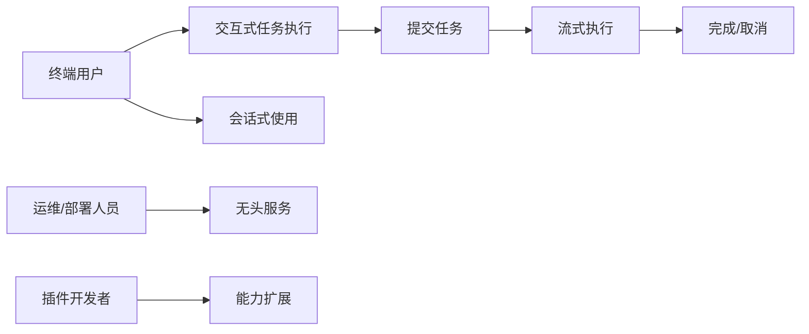
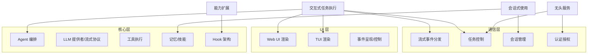
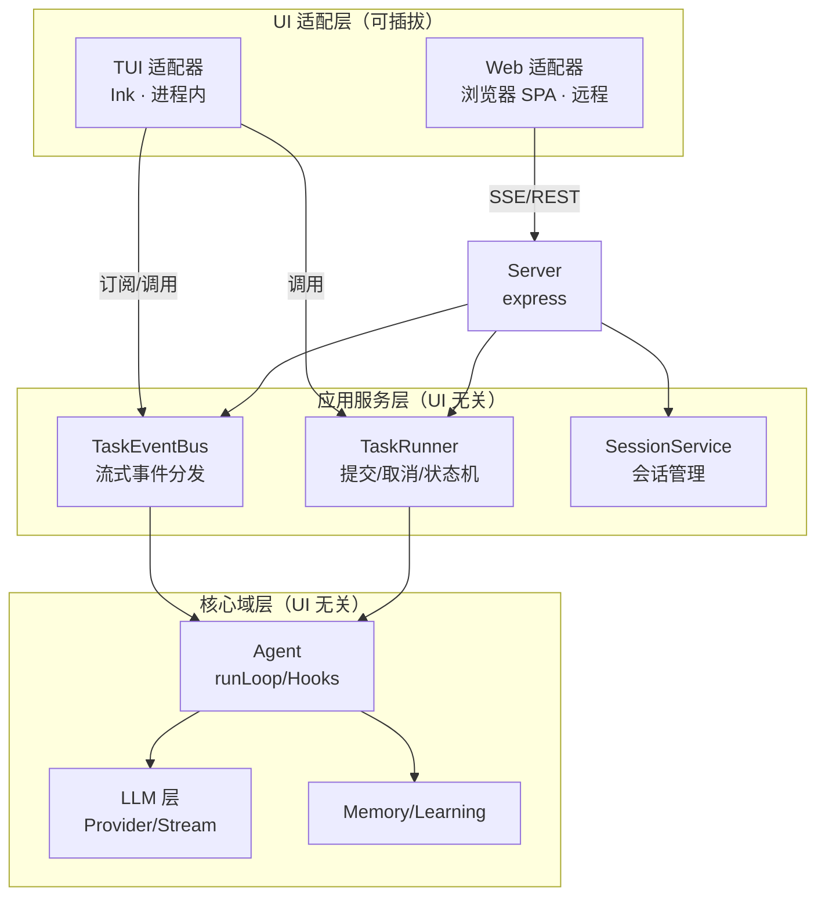
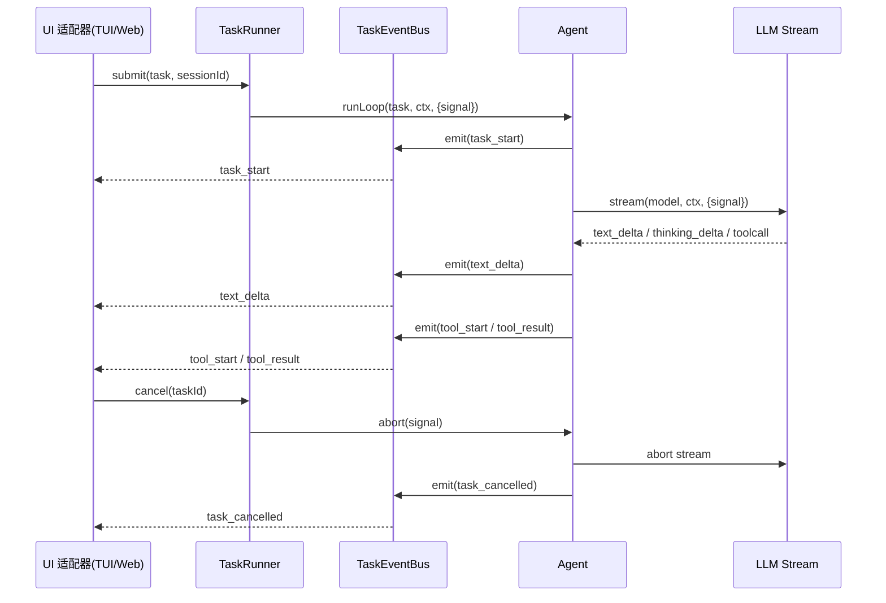
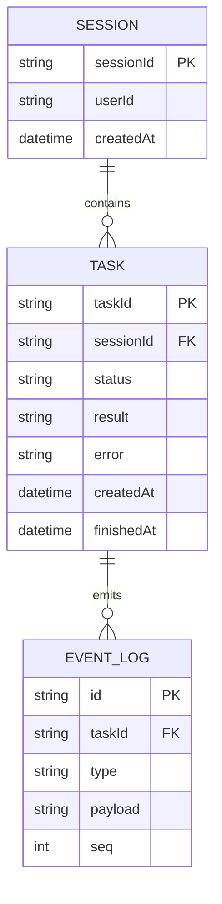
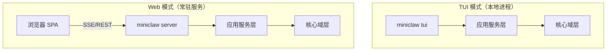

z# Miniclaw 双界面（Web + TUI）架构设计文档

**版本:** 1.0
**日期:** 2026-08-23
**状态:** Draft
**PRD 参考:** miniclaw 双界面架构需求 + `prd-analysis.md`

---

## 目录

1. 概述
2. 需求总结
3. 业务架构（IE 元模型）
4. 架构概览
5. 系统模块设计
6. 数据设计
7. 接口设计
8. 非功能性设计
9. 技术栈
10. 部署方案
11. 风险与待决事项

---

## 1. 概述

### 1.1 项目背景
Miniclaw 目前是纯 CLI/无头服务形态：`Agent`（src/agent.ts）编排 LLM 与工具，`cli.ts` 提供命令行入口，`server.ts` 提供 REST + SSE 无头 API。目标是在不改动核心能力的前提下，同时提供 **Web UI（浏览器）** 与 **TUI（终端交互）** 两种前端，且两种界面可插拔、可独立演进。

### 1.2 核心目标
- **可插拔双 UI**：Web / TUI 作为独立适配器挂到同一核心，可单独启用、可替换
- **实时流式**：LLM token 流、thinking、工具执行进度实时呈现（当前 `onProgress` 只有 4 个粗粒度 stage，token 级流尚未打通到 agent 层）
- **UI 无关核心**：Agent/LLM/Memory/Hooks 零 UI 依赖，通过事件协议与 UI 解耦
- **保留无头模式**：现有 REST/SSE API 继续可用，作为 Web 的前端

### 1.3 关键约束
| 约束类型 | 描述 |
|---------|------|
| 技术栈 | TypeScript / Node / CommonJS，tsc 编译到 dist |
| 现有资产 | express 服务、commander CLI、hook 架构、provider factory、`StreamEvent` 事件类型、memory session-manager |
| 运行形态 | 单进程优先；TUI 本地进程，Web 常驻服务 |

---

## 2. 需求总结

### 2.1 功能性需求
| 编号 | 需求 | 优先级 | 说明 |
|------|------|--------|------|
| FR-001 | Web UI（浏览器）| P0 | 任务输入、流式输出、工具进度、结果展示 |
| FR-002 | TUI（终端交互）| P0 | 同上，终端内交互 |
| FR-003 | 界面模块可插拔 | P0 | Web/TUI 独立适配器，可单独启用 |
| FR-004 | 实时流式输出 | P0 | token / thinking / tool 进度实时 |
| FR-005 | 主程序与 UI 通信协议 | P0 | 统一任务事件协议 + 双通道传输 |
| FR-006 | 任务取消 | P1 | UI 可中断任务（AbortSignal 贯穿）|
| FR-007 | 会话历史与恢复 | P1 | 跨界面共享会话（复用 memory）|
| FR-008 | 无头 API 保留 | P1 | /execute、/execute/stream 兼容 |

### 2.2 非功能性需求
| 编号 | 需求 | 目标值 |
|------|------|--------|
| NFR-001 | 首 token 延迟 | < 1.5s [ASSUMPTION] |
| NFR-002 | 核心 UI 无关 | 核心层零 UI import（lint 约束）|
| NFR-003 | 事件不丢 | 每个事件独立即时分发 [ASSUMPTION] |
| NFR-004 | 可测试性 | 核心 + 通信层可在无 UI 情况下测试 |
| NFR-005 | 兼容性 | 现有 REST/SSE 行为不变 |

### 2.3 假设与依赖
- [ASSUMPTION] TUI 技术栈采用 Ink（React 终端渲染），替代方案 blessed
- [ASSUMPTION] Web UI 为浏览器 SPA，经 HTTP/SSE 与后端通信
- [ASSUMPTION] 单机部署为主，进程内通信优先

---

## 3. 业务架构（IE 元模型）

### 3.1 利益相关方
| 编号 | 利益相关方 | 类型 | 核心诉求 |
|------|-----------|------|---------|
| SH-001 | 终端用户 | 用户 | 用 Web/TUI 舒适完成任务，实时可见执行过程 |
| SH-002 | 运维/部署人员 | 运维 | 无头部署、简单配置、认证安全、并发可控 |
| SH-003 | 插件开发者 | 合作伙伴 | 基于 hook 扩展，不被 UI 耦合 |
| SH-004 | 核心开发者 | 内部 | 核心保持 UI 无关，界面可插拔 |

### 3.2 价值流



| 价值流 | 利益相关方 | 阶段 | 交付价值 |
|--------|-----------|------|---------|
| 交互式任务执行 | 终端用户 | 提交 → 流式 → 完成/取消 | 实时可见的任务执行 |
| 会话式使用 | 终端用户 | 建会话 → 多轮 → 恢复 | 上下文可追溯 |
| 无头服务 | 运维 | 鉴权 → 执行 → 返回 | 程序化调用 |
| 能力扩展 | 插件开发者 | 注册 hook → 生效 | 任意界面生效的扩展 |

### 3.3 业务能力地图



### 3.4 关键业务规则汇总
| 规则编号 | 规则描述 | 约束的流程 | 所属业务能力 | 优先级 |
|---------|---------|-----------|------------|--------|
| BR-001 | 任务必须有唯一 taskId，事件按 taskId 分组 | 交互式任务执行 | 流式事件分发 | 高 |
| BR-002 | 事件流单向（服务→UI）；控制反向（UI→服务）| 交互式任务执行 | 任务控制 | 高 |
| BR-003 | 取消必须贯穿到 LLM 流（AbortSignal）| 交互式任务执行 | 任务控制 | 高 |
| BR-004 | 核心层禁止 import UI 适配器 | 全流程 | Hook 架构 | 中 |

---

## 4. 架构概览

### 4.1 架构风格与理由
**选型:** 模块化单体（Modular Monolith）+ 端口-适配器（Ports & Adapters / Hexagonal）

**理由:**
- 系统为中小型、单进程部署、团队规模小，微服务是过度设计
- 但 UI 边界需要**强解耦**：通过「端口-适配器」把 UI 作为适配器插入，核心域面向端口（事件协议 + 服务接口）编程
- 现有 hook 架构、provider factory 已是「面向接口」风格，与端口-适配器天然契合

### 4.2 架构图



### 4.3 关键架构决策
| 决策编号 | 决策 | 选项 | 选定方案 | 理由 |
|---------|------|------|---------|------|
| AD-001 | 任务事件协议 | 扩展现有 onProgress vs 统一事件流 | **统一 TaskEvent 协议**（融合 StreamEvent + ProgressEvent + 工具/hook 事件）| 打通 token 级流式（[GAP-001]），双 UI 消费同一协议 |
| AD-002 | UI 集成方式 | 直接耦合 vs 端口-适配器 | **端口-适配器**，UIAdapter 接口 + 组合根装配 | 核心零 UI 依赖（NFR-002），UI 可插拔 |
| AD-003 | Web 传输 | 仅 SSE vs SSE+REST vs WebSocket | **SSE 推事件 + REST 控制**（WS 后续可选）| 复用现有 SSE 基础设施，单向事件流 + 同步控制语义清晰 |
| AD-004 | TUI 传输 | 进程内回调 vs 本地 HTTP | **进程内 EventBus 订阅** | 避免本机 socket 复杂度，与 Web 共用同一事件协议 |
| AD-005 | 任务取消 | 无 vs AbortController 贯穿 | **AbortController → Agent → LLM stream.signal** | `StreamOptions.signal` 已支持，补齐链路（[GAP-005]）|
| AD-006 | 会话绑定 | taskId 独立 vs 绑定 sessionId | **taskId + sessionId 双标识**，复用 memory session-manager | 跨界面恢复会话（FR-007）|

---

## 5. 系统模块设计

### 5.1 模块划分（业务能力驱动）

#### 应用服务层 `src/app/`（新增，UI 无关）
- **支撑的业务能力:** 流式事件分发（CAP-004）、任务控制（CAP-005）、会话管理（CAP-006）
- **价值流追溯:** 交互式任务执行、会话式使用、无头服务
- **职责:** UI 与核心之间的「中间人」，暴露稳定服务接口，持有任务状态
- **关键技术:** TypeScript，纯逻辑（可单测）

| 文件 | 职责 |
|------|------|
| `task-events.ts` | 统一 `TaskEvent` 判别联合（见 §7.2）|
| `event-bus.ts` | `TaskEventBus`：按 taskId 订阅/广播，同步分发 |
| `task-runner.ts` | `TaskRunner`：submit/cancel/getStatus，任务状态机 + AbortController 映射 |
| `session-service.ts` | 包装 memory session-manager，暴露会话 CRUD |
| `ui-host.ts` | `UIHost`：注册/装配 UI 适配器（组合根）|

#### UI 适配层 `src/ui/`（新增，可插拔）
- **支撑的业务能力:** Web UI 渲染（CAP-001）、TUI 渲染（CAP-002）、事件呈现/控制（CAP-003）
- **价值流追溯:** 交互式任务执行
- **职责:** 把 `TaskEvent` 呈现为用户可见的界面，把用户意图转为控制调用
- **关键技术:** TUI → Ink；Web → 浏览器前端（框架待定）

| 文件 | 职责 |
|------|------|
| `adapter.ts` | `UIAdapter` 端口接口（见 §5.3）|
| `tui/` | TUI 实现：订阅 EventBus、渲染流式输出、键位控制 |
| `web/` | Web 前端源码 + 构建产物（由 server 承载）|

#### 核心域层（现有，保持 UI 无关）
- `agent.ts`：**升级** `runLoop` 改为消费 LLM `StreamEvent` 并合成 `TaskEvent` 流（见 AD-001）
- `server.ts`：**升级** 新增 `/api/tasks/*` 事件与控制端点，承载 Web 适配器
- `cli.ts`：**升级** 新增 `tui` 命令（进程内装配 TUI 适配器）
- `llm/`、`memory/`、`learning/`、`core/`：**保持不变**（仅 `agent.ts` 内部改用 stream 路径）

### 5.2 业务能力-模块追溯矩阵
| 价值流 | 价值流阶段 | 业务能力 | 支撑模块 | 利益相关方 |
|--------|-----------|---------|---------|-----------|
| 交互式任务执行 | 提交任务 | 任务控制 | app/task-runner | 终端用户 |
| 交互式任务执行 | 流式执行 | 流式事件分发 | app/event-bus + agent | 终端用户 |
| 交互式任务执行 | 完成/取消 | 任务控制 | app/task-runner + llm | 终端用户 |
| 会话式使用 | 多轮/恢复 | 会话管理 | app/session-service + memory | 终端用户 |
| 无头服务 | 鉴权/返回 | 认证授权 | server（现有）| 运维 |

### 5.3 模块交互图



### 5.4 通信协议与数据流
| 调用方 | 被调方 | 协议 | 数据格式 | 同步/异步 |
|--------|--------|------|---------|----------|
| TUI → TaskRunner | app 层 | 方法调用（进程内）| TaskEvent/命令对象 | 控制同步 / 事件异步 |
| Web → Server | HTTP | REST（控制）/ SSE（事件）| JSON / text/event-stream | 控制同步 / 事件异步 |
| TaskRunner → Agent | 核心 | 方法调用 | Context + AbortSignal | 异步 |
| Agent → EventBus | 应用层 | 方法调用 | TaskEvent | 同步广播 |

---

## 6. 数据设计

### 6.1 数据模型



### 6.2 存储选型
| 数据类型 | 存储技术 | 选型理由 |
|---------|---------|---------|
| 会话/记忆 | 现有 better-sqlite3（memory 层）| 复用，不新增 |
| 任务事件日志（可选）| 内存 + 可选落盘 | 事件流主要用于实时呈现；如需回放/恢复再持久化 [ASSUMPTION] |

---

## 7. 接口设计

### 7.1 对外接口（Web 后端，HTTP）

| 方法 | 路径 | 说明 | 触发角色 | 认证 |
|------|------|------|---------|------|
| POST | /api/tasks | 提交任务 `{task, sessionId?}` → `{taskId}` | 终端用户 | Required |
| GET | /api/tasks/:taskId/events | SSE 事件流（task_start→…→task_done/error/cancelled）| 终端用户 | Required |
| POST | /api/tasks/:taskId/cancel | 取消任务 | 终端用户 | Required |
| GET | /api/tasks/:taskId | 任务状态/结果（断线恢复用）| 终端用户 | Required |
| GET | /api/sessions | 会话列表 | 终端用户 | Required |
| POST | /api/sessions | 创建会话 | 终端用户 | Required |
| GET | /health | 健康检查 | 运维 | 无 |

> 兼容：保留现有 `POST /execute`、`GET /execute/stream`（FR-008），内部走同一 TaskRunner。

### 7.2 统一任务事件协议（核心契约）

```ts
type TaskEvent =
  | { type: 'task_start'; taskId: string; sessionId?: string; timestamp: number }
  | { type: 'thinking_delta'; taskId: string; delta: string }
  | { type: 'text_delta'; taskId: string; delta: string }
  | { type: 'tool_start'; taskId: string; toolName: string; args: unknown }
  | { type: 'tool_result'; taskId: string; toolName: string; result: string; success: boolean }
  | { type: 'stage'; taskId: string; stage: 'thinking' | 'executing' | 'completed' }
  | { type: 'task_done'; taskId: string; result: string; usage?: Usage }
  | { type: 'task_error'; taskId: string; error: string }
  | { type: 'task_cancelled'; taskId: string; reason: string };
```

- **来源融合**：`text_delta`/`thinking_delta` 源自 LLM `StreamEvent`（已存在）；`tool_start`/`tool_result`/`stage` 源自现有 `ProgressEvent`（升级扩展）；`task_*` 源自 TaskRunner 状态机
- **传输无关**：TUI 进程内直接拿对象；Web 经 SSE 序列化为 `event: task_event\ndata: {json}`

### 7.3 UI 端口接口

```ts
/** UI 适配器端口 —— 由 UI 实现，由 UIHost 装配 */
export interface UIAdapter {
  readonly id: 'tui' | 'web';
  /** 挂载：订阅事件流，暴露控制能力 */
  attach(host: { events: TaskEventBus; control: TaskRunner; sessions: SessionService }): void;
}
```

### 7.4 认证与授权
- 复用现有 Bearer Token 中间件；Web 端在前端提供 token 输入，SSE 用 query 参数或 header 携带 [ASSUMPTION]
- 多用户/RBAC 不在本期范围（[GAP] 待决）

---

## 8. 非功能性设计

### 8.1 可扩展性
- 事件总线同步分发，单进程内无网络瓶颈；若未来多实例，EventBus 可替换为进程外（Redis pub/sub）而不改 UI 代码 [ASSUMPTION]

### 8.2 安全性
- 现有 Bearer Token 鉴权延续到新 `/api/tasks/*` 端点
- SSE 端点同样鉴权（现有 `/execute/stream` 已如此）

### 8.3 可观测性
- 复用 `src/logger.ts` 结构化日志；`taskId` 作为关联 ID 贯穿请求 → 执行 → 事件
- LLM 调用日志（registry 的 logCallStart/Complete）已具备

### 8.4 容错与恢复
- SSE 断线：浏览器 `EventSource` 自动重连；配合 `GET /api/tasks/:id` 做最终态兜底
- 任务失败不崩溃进程：TaskRunner 捕获错误并 emit `task_error`，复用现有 hook 错误隔离模式

### 8.5 性能目标
| 指标 | 目标值 | 测量方式 | 关联价值流 |
|------|--------|---------|-----------|
| 首 token 延迟 | < 1.5s [ASSUMPTION] | agent 直连 streamResponse 路径计时 | 交互式任务执行 |
| 事件分发延迟 | < 10ms 进程内 [ASSUMPTION] | EventBus 分发耗时 | 交互式任务执行 |

---

## 9. 技术栈

| 层次 | 技术 | 版本 | 用途 | 选型理由 |
|------|------|------|------|---------|
| 后端 | Node + TypeScript + express | 现有 | 服务承载 | 已用，零迁移 |
| 事件流 | SSE（现有 `text/event-stream`）| — | Web 事件推送 | 复用现有实现 |
| TUI | Ink（React for terminal）| ^5 [ASSUMPTION] | TUI 渲染 | React 生态、流式渲染友好 |
| Web 前端 | React/Vue + Vite [ASSUMPTION] | — | SPA | 待定，不影响后端协议 |
| 数据库 | better-sqlite3（现有）| 现有 | 会话/记忆 | 复用 |

---

## 10. 部署方案

### 10.1 部署架构图



### 10.2 环境规划
| 环境 | 用途 | 规模 |
|------|------|------|
| Development | 双 UI 联调 | 本机单进程 |
| Production | 无头 + Web | 单进程常驻服务 |

---

## 11. 风险与待决事项

### 11.1 风险登记
| 编号 | 风险 | 影响范围 | 影响 | 可能性 | 缓解措施 |
|------|------|---------|------|--------|---------|
| R-001 | `runLoop` 从聚合 `generateResponse` 改造为流式 `streamResponse`，可能影响现有记忆/hook 时序 | 核心执行 | 高 | 中 | 事件协议先定义；agent 内部增量改造，保留 generateResponse 兜底路径 |
| R-002 | TUI 技术栈选型（Ink vs blessed）影响后续投入 | UI 层 | 中 | 中 | 协议先行，UI 适配器最后实现；先做 Web（复用 SSE）验证协议 |
| R-003 | SSE 断线/代理缓冲导致事件延迟 | Web 实时性 | 中 | 中 | 设置 `Cache-Control: no-cache`；用 final-state 兜底 |
| R-004 | 事件协议随需求膨胀 | 协议稳定性 | 中 | 中 | 判别联合 + 版本化；新增字段向后兼容 |

### 11.2 待决事项
| 编号 | 事项 | 负责人 | 截止日期 |
|------|------|--------|---------|
| TBD-001 | TUI 技术选型（Ink vs blessed）| 核心开发者 | — |
| TBD-002 | Web 前端框架（React/Vue/其他）| 核心开发者 | — |
| TBD-003 | 是否持久化任务事件日志（会话回放）| 核心开发者 | — |
| TBD-004 | 多用户/RBAC 是否纳入 Web 范围 | 核心开发者 | — |
