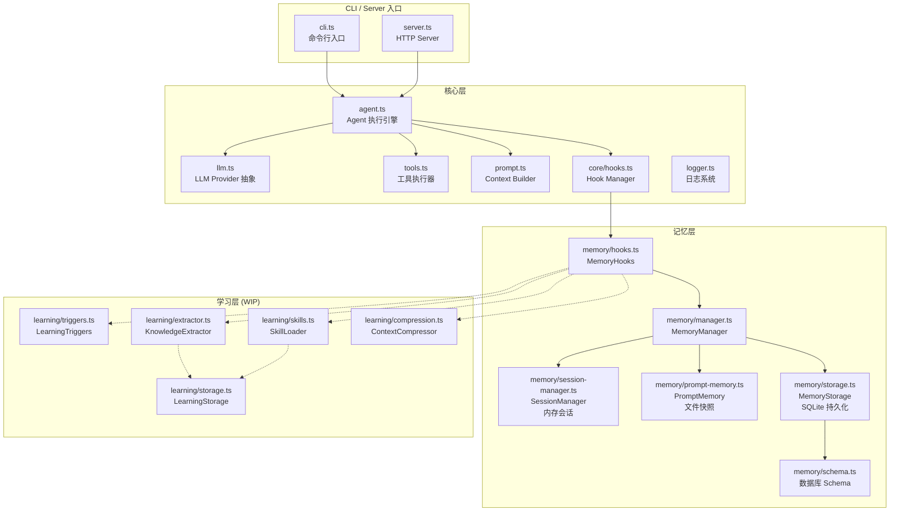
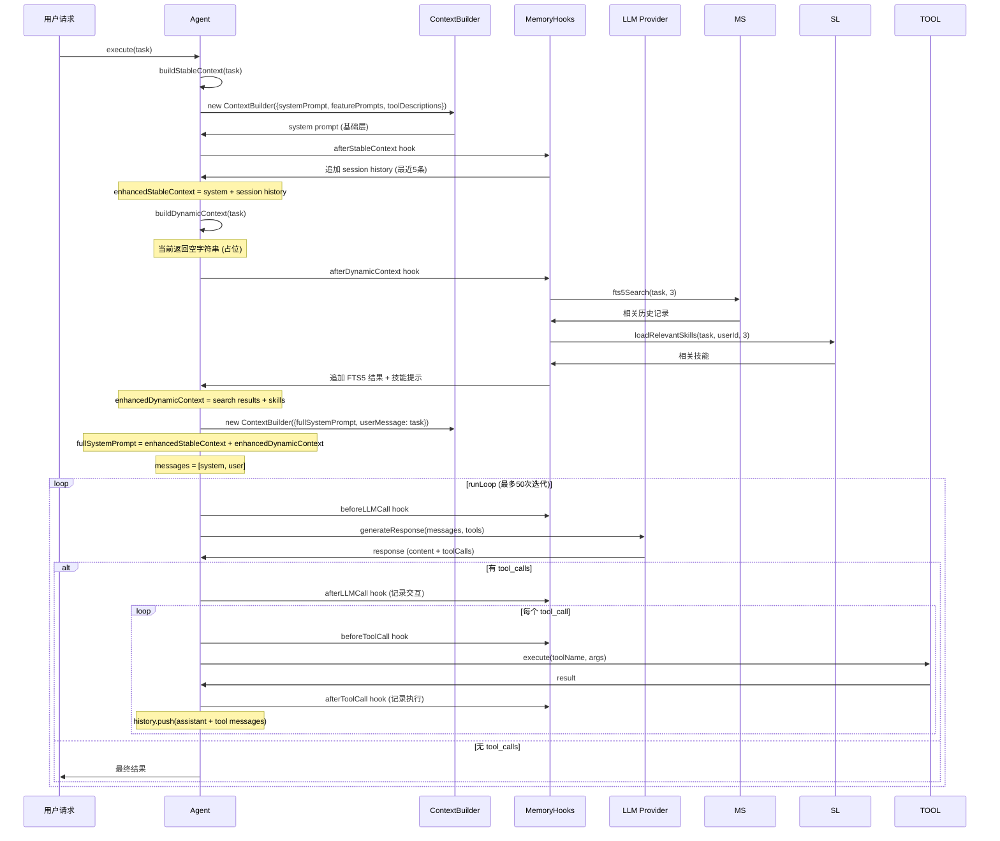
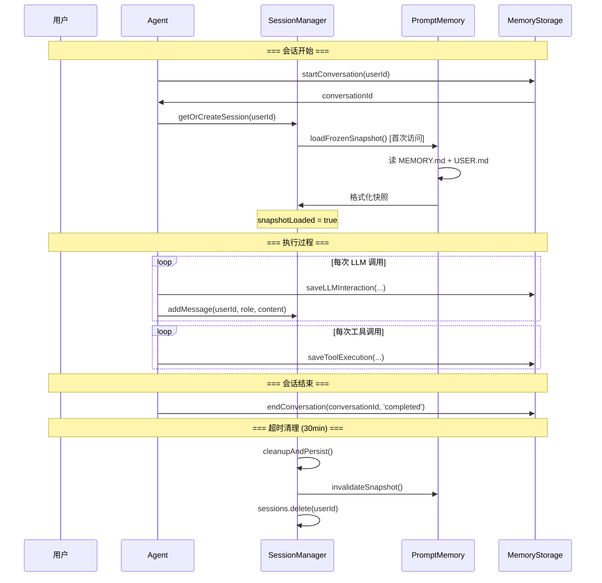
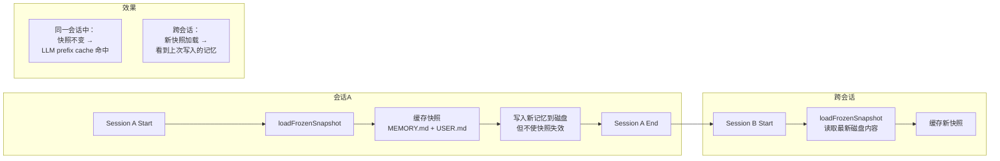
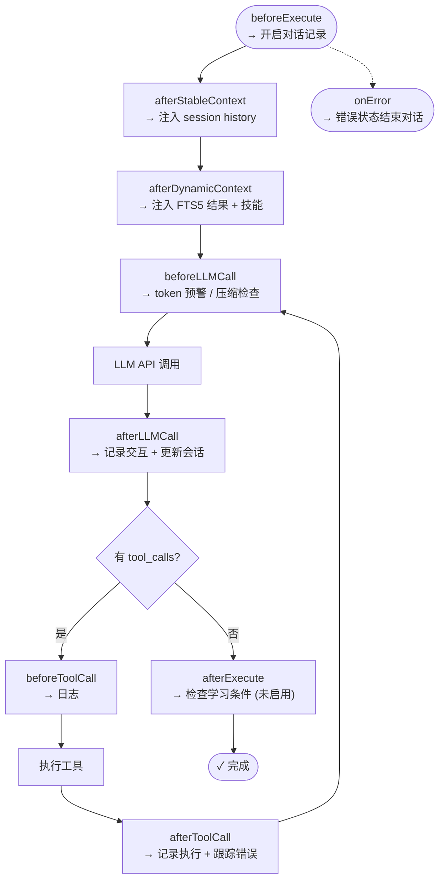
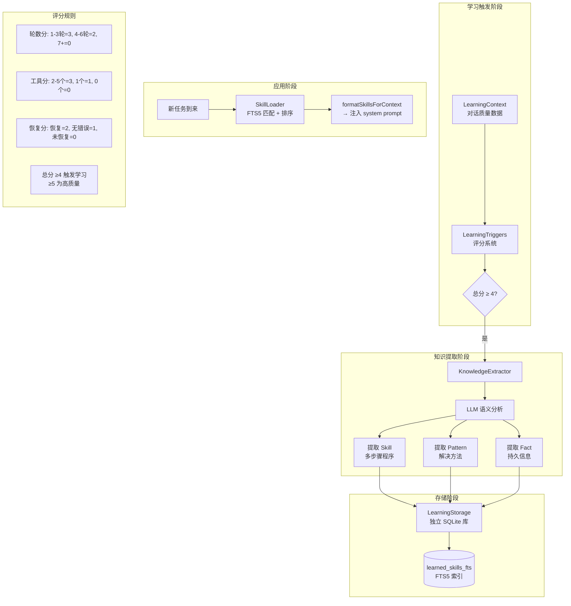

# Miniclaw 设计分析

> 分析日期：2026-07-11
> 分析范围：Prompt 设计、记忆管理、可优化点

---

## 目录

1. [总体架构](#1-总体架构)
2. [Prompt 设计分析](#2-prompt-设计分析)
3. [记忆管理分析](#3-记忆管理分析)
4. [学习系统分析](#4-学习系统分析)
5. [可优化点汇总](#5-可优化点汇总)

---

## 1. 总体架构



---

### 1.1 Context Builder 与 MemoryHooks 协作关系

#### 角色定位

| 维度 | Context Builder (`prompt.ts`) | MemoryHooks (`memory/hooks.ts`) |
|------|-------------------------------|-------------------------------|
| 角色 | **静态组装器** | **动态注入器** |
| 职责 | 将 system prompt + feature prompts + tool descriptions + history + user message 拼成 `ChatMessage[]` | 在 Agent 执行关键节点向上下文追加记忆数据（session history、FTS5 搜索结果、技能） |
| 状态 | 纯函数式，无状态 | 有状态（持有 MemoryManager、SessionManager 引用） |
| 是否感知对方 | ❌ 完全不感知 | ❌ 完全不感知 |

**两者之间没有直接依赖。** ContextBuilder 不知道 MemoryHooks 的存在，MemoryHooks 也不调用 ContextBuilder。所有交互通过 **Agent 编排 + HookManager 调度** 完成，遵循装饰器模式 + 管道模式。

#### 三阶段协作流程

```
第一阶段：构建 Stable Context（缓存优化的不变部分）
─────────────────────────────────────────────────────
  Agent.buildStableContext()                           [agent.ts:280]
    └─ new ContextBuilder({
         systemPrompt,         // Layer 0: 狭义 system prompt
         featurePrompts,       // Layer 1: 功能提示
         toolDescriptions,     // Layer 2: 工具描述
         userMessage: '',      // 故意传空——本阶段只关心 system prompt
       }).build()
         └─ buildSystemPrompt() → 合并 Layer 0+1+2 的字符串

  ──→ [Hook] afterStableContext                        [agent.ts:574-586]
    └─ MemoryHooks.onAfterStableContext()               [memory/hooks.ts:89]
         └─ context.context += session history（最近5条）→ Layer 3

  结果: enhancedStableContext = Layer 0+1+2+3 合并字符串

第二阶段：构建 Dynamic Context（每次任务可变的动态部分）
─────────────────────────────────────────────────────
  Agent.buildDynamicContext()                           [agent.ts:302]
    └─ 返回空字符串（占位，自身不做任何事）

  ──→ [Hook] afterDynamicContext                        [agent.ts:594-608]
    └─ MemoryHooks.onAfterDynamicContext()               [memory/hooks.ts:113]
         ├─ FTS5 搜索相关历史 → Layer 4a
         └─ SkillLoader 加载相关技能 → Layer 4b

  结果: enhancedDynamicContext = Layer 4a+4b 合并字符串

第三阶段：组装最终消息（进入 runLoop）
─────────────────────────────────────────────────────
  Agent.runLoop()                                       [agent.ts:324]
    └─ fullSystemPrompt = enhancedStableContext + enhancedDynamicContext
    └─ new ContextBuilder({
         systemPrompt: fullSystemPrompt,  // 此时已是所有层的合并体
         featurePrompts: [],              // ▲ 显式清空——已包含在 fullSystemPrompt 中
         toolDescriptions: [],            // ▲ 显式清空——同上
         userMessage: input,              // ★ 用户输入在此处首次传入
       }).build()
         → prefixMessages = [{ role: 'system', content: fullSystemPrompt }]
         → history = [{ role: 'user', content: input }]
    └─ allMessages = [...prefixMessages, ...history]
         → 最终发往 LLM 的 messages 数组
```

**关键结论：用户输入既不参与 stable context 的构建，也不参与 dynamic context 的构建。** 它只在 `runLoop` 开始前被包装成一条 `{ role: 'user' }` 消息，作为对话的第一条历史。这种两阶段设计让 system prompt 的缓存（OpenAI prefix caching）不会因为用户输入变化而失效。

#### 增强层完整结构

```
                    .──────────────────────────────────.
                    │       最终 system prompt           │
                    ├──────────────────────────────────┤
         ┌─────────▶│ Layer 0: 狭义 system prompt       │
         │          │   (DEFAULT_SYSTEM_PROMPT)         │
         │  Context ├──────────────────────────────────┤
         │  Builder │ Layer 1: 功能提示 (featurePrompts) │
         │  组装    ├──────────────────────────────────┤
         │          │ Layer 2: 工具描述                  │
         ├─────────▶├──────────────────────────────────┤
         │          │ Layer 3: 会话历史                  │
         │  Memory  │   (SessionManager 最近5条)         │
         │  Hooks   ├──────────────────────────────────┤
         │  注入    │ Layer 4a: FTS5 搜索结果            │
         │          │ Layer 4b: 相关技能                │
         └─────────▶└──────────────────────────────────┘
```

#### 设计意图

- **ContextBuilder** 负责"怎么拼"——格式与顺序，保持纯净可测试
- **MemoryHooks** 负责"拼什么"——内容来源，注入记忆数据
- **Agent** 负责"何时触发"——编排构建流程
- 这种分层使得记忆系统可独立演进、Prompt 构建逻辑可单独测试、执行流程清晰可追踪

---

## 2. Prompt 设计分析

### 2.1 Prompt 构建流程



### 2.2 系统提示（System Prompt）组成

```
┌────────────────────────────────────────────────────────┐
│                  完整 System Prompt                      │
├────────────────────────────────────────────────────────┤
│                                                        │
│  ┌────────────────────────────────────────────────┐   │
│  │ Layer 0: 基础系统提示                            │   │
│  │ "You are Miniclaw, a minimal AI agent..."       │   │
│  │ (DEFAULT_SYSTEM_PROMPT 或用户自定义)              │   │
│  └────────────────────────────────────────────────┘   │
│                                                        │
│  ┌────────────────────────────────────────────────┐   │
│  │ Layer 1: 功能提示                                │   │
│  │ (featurePrompts 数组，可注入额外指令)              │   │
│  └────────────────────────────────────────────────┘   │
│                                                        │
│  ┌────────────────────────────────────────────────┐   │
│  │ Layer 2: 工具描述                                │   │
│  │ "Available tools:"                              │   │
│  │ "- file_read: Read file contents..."            │   │
│  │ "- bash: Execute a bash command..."             │   │
│  │ "... 共 8 个工具"                                │   │
│  └────────────────────────────────────────────────┘   │
│                                                        │
│  ┌────────────────────────────────────────────────┐   │
│  │ Layer 3: Session History (由 MemoryHooks 注入)   │   │
│  │ "## Recent Conversation"                        │   │
│  │ "user: ..." "assistant: ..." (最近5条)           │   │
│  └────────────────────────────────────────────────┘   │
│                                                        │
│  ┌────────────────────────────────────────────────┐   │
│  │ Layer 4: 动态上下文 (由 MemoryHooks 注入)         │   │
│  │ "## Relevant Past Conversations"                │   │
│  │ "## Relevant Skills" (FTS5 搜索结果 + 技能)      │   │
│  └────────────────────────────────────────────────┘   │
│                                                        │
└────────────────────────────────────────────────────────┘
```

### 2.3 迭代中的消息结构

```
回合 1:  [system, user]                              → LLM → [tool_calls]
回合 2:  [system, user, assistant(tc), tool, ...]    → LLM → [tool_calls]
回合 3:  [system, user, assistant(tc1), tool1, ...,
           assistant(tc2), tool2, ...]                → LLM → [最终回复]
```

### 2.4 Provider 与模型

| Provider | 默认模型 | 默认 Base URL | 环境变量覆盖 |
|----------|---------|---------------|-------------|
| openai   | gpt-4o-mini | https://api.openai.com/v1 | OPENAI_MODEL |
| deepseek | deepseek-chat | https://api.deepseek.com | DEEPSEEK_MODEL |
| kimi     | moonshot-v1-8k | https://api.moonshot.cn/v1 | KIMI_MODEL |
| qwen     | qwen-turbo | https://dashscope.aliyuncs.com/compatible-mode/v1 | QWEN_MODEL |

---

## 3. 记忆管理分析

### 3.1 三层架构总览

```mermaid
graph TB
    subgraph "应用层"
        AGT[Agent]
    end

    subgraph "记忆管理层"
        MM[MemoryManager<br/>统一接口 & 委派模式]
    end

    subgraph "第一层: 会话记忆"
        SM[SessionManager]
        SM_MAP[Map&lt;userId, UserSession&gt;<br/>内存 Map]
        SM_SESSION[UserSession:<br/>- messages[] 最多20条<br/>- lastActivity<br/>- snapshotLoaded]
    end

    subgraph "第二层: 文件快照"
        PM[PromptMemory]
        PM_SNAP[FrozenSnapshot<br/>会话级缓存]
        PM_MD[MEMORY.md<br/>上限 2,200 字符]
        PM_US[USER.md<br/>上限 1,375 字符]
    end

    subgraph "第三层: 数据库持久化"
        MS[MemoryStorage]
        DB[(SQLite WAL 模式)]
        DB_T1[conversations 表]
        DB_T2[llm_interactions 表]
        DB_T3[tool_executions 表]
        DB_FTS[(interactions_fts<br/>FTS5 全文索引)]
    end

    AGT --> MM
    MM --> SM
    MM --> PM
    MM --> MS

    SM --> SM_MAP
    SM_MAP --> SM_SESSION

    PM --> PM_SNAP
    PM_SNAP --> PM_MD
    PM_SNAP --> PM_US

    MS --> DB
    DB --> DB_T1
    DB --> DB_T2
    DB --> DB_T3
    DB_T2 -.-> DB_FTS
```

### 3.2 会话生命周期



### 3.3 快照机制详解



**设计意图**：
- 利用 LLM API 的 **prefix caching**（如 OpenAI 的 prompt caching），在同一会话中 system prompt 不变，大幅节省 token 开销（~50-70%）
- 记忆写入立即落盘，但**不失效当前会话快照**——新内容在下一个会话才可见
- `invalidateSnapshot()` 只在会话边界调用

### 3.4 Hook 架构与执行顺序



**优先级体系**：
- `priority: 10` — Memory 系统（最早执行，可修改上下文）
- `priority: 20` — Monitor（中间层）
- `priority: 50` — Logger（最晚执行，只读）

---

## 4. 学习系统分析

### 4.1 设计架构（当前状态：WIP / 未接入）



### 4.2 未接入的原因

```typescript
// memory/hooks.ts 构造函数
constructor(
    private memoryManager: MemoryManager,
    private sessionManager: SessionManager,
    learningStorage?: LearningStorage,   // ← 未传入
    llmProvider?: LLMProvider,           // ← 未传入
    memoryStorage?: MemoryStorage        // ← 未传入
) {
    // 因 learningStorage 为 undefined，以下全部不初始化
    if (learningStorage) { ... }
}

// agent.ts initializeMemoryHooks()
private initializeMemoryHooks(): void {
    const memoryHooks = new MemoryHooks(
        memoryManager,
        sessionManager
        // 缺少 learningStorage, llmProvider, memoryStorage 参数
    );
}
```

---

## 5. 可优化点汇总

### 5.1 Prompt 构建优化

| 优先级 | 分类 | 问题 | 影响 | 建议 |
|--------|------|------|------|------|
| 🔴 高 | Prompt | `ContextBuilder` 重复拼接风险 | 可能导致 system prompt 中 tool 描述重复，浪费 token | 增加 `skipToolDescriptions` 参数或拆分为独立的 `buildSystemOnly` 方法 |
| 🟡 中 | Prompt | `estimateTokens` 对中文估算偏差大 | 中文按 `length/4` 估算只有实际的 ~50%，导致 token 预警不准确 | 接入 `tiktoken` 或对中文字符做加权 |
| 🟡 中 | Prompt | 无 streaming 支持 | 长时间任务无中间反馈，Server SSE 端点也只能等完整结果 | `LLMProvider` 增加 streaming 模式，透传给 SSE |
| 🟡 中 | Prompt | dynamic context 无长度保护 | 如果 FTS5 结果和 skills 内容过多，system prompt 可能超限 | 在 `afterDynamicContext` 中做截断，或启用 `ContextCompressor` |

### 5.2 记忆系统优化

| 优先级 | 分类 | 问题 | 影响 | 建议 |
|--------|------|------|------|------|
| 🔴 高 | 内存 | `SessionManager` 的 `sessions` Map 泄漏风险 | 极端情况下内存持续增长 | 增强清理逻辑，或在 `cleanupAndPersist` 失败时保证删除过期会话 |
| 🟡 中 | 持久化 | `MemoryStorage` 存储完整 LLM 交互原文 | 数据库快速膨胀（prompt + response 原文） | 定期压缩旧记录（表已有 `compressed` 字段），或设置保留期限 |
| 🟡 中 | 持久化 | FTS5 无 `UPDATE` trigger | `llm_interactions` 更新不会同步到 FTS 索引 | 添加 `AFTER UPDATE` trigger，或确认当前代码无 update 需求 |
| 🟢 低 | 设计 | `PromptMemory` 的 `LLMProvider` 接口与 `llm.ts` 类型重名 | `compressWithLLM` 无法被调用，超过 80% 字符上限时失去智能压缩能力 | 重命名接口或统一类型定义 |

### 5.3 架构与并发优化

| 优先级 | 分类 | 问题 | 影响 | 建议 |
|--------|------|------|------|------|
| 🔴 高 | 并发 | Server 模式共享单 Agent 实例 + 可变实例变量 | 多请求并发时 `enhancedStableContext` / `enhancedDynamicContext` 互相覆盖 | 每请求创建独立 Agent 实例，或用请求级上下文替代实例变量 |
| 🟡 中 | 并发 | LLM 调用无 `AbortController` | 超时的请求仍在后台运行，浪费资源 | 将 `AbortSignal` 传递到 OpenAI SDK |
| 🟡 中 | 质量 | Hook 错误处理不一致 | 部分 `catch` 日志级别不统一，`agent.ts:416` 有 `XXX` 占位注释 | 统一错误处理策略 |
| 🟢 低 | 安全 | `isDangerousPythonCode` 过度封锁 | `import os` 等正常操作被拦截 | 更细粒度的白名单模式 |

### 5.4 学习系统决策

| 优先级 | 分类 | 问题 | 建议 |
|--------|------|------|------|
| 🟡 中 | WIP | 学习系统代码完整但未接入（`learningStorage` 未注入） | 决策路径：① 如果要接入 → 补全依赖注入；② 如果暂不使用 → 删除 dead code 或加 TODO |
| 🟡 中 | 风险 | `KnowledgeExtractor` 在 `afterExecute` 中同步调用 LLM | 改为完全异步执行，避免阻塞任务响应 |
| 🟢 低 | 风险 | 低质量技能可能污染系统 | 先启用 `suggest` 模式（仅注入上下文），待验证后再启用 `auto` |

---

## 附录

### A. 文件结构

```
src/
├── agent.ts              # Agent 核心引擎 + Hook 驱动
├── cli.ts                # 命令行入口
├── llm.ts                # LLM Provider 抽象层
├── logger.ts             # 日志系统
├── prompt.ts             # ContextBuilder + ChatMessage 类型
├── server.ts             # HTTP Server（Express）
├── tools.ts              # 工具执行器
├── tools-schema.ts       # 工具定义（OpenAI function calling 格式）
├── core/
│   └── hooks.ts          # HookManager + 9 个 Hook 点定义
├── memory/
│   ├── hooks.ts          # MemoryHooks（注册到 HookManager）
│   ├── index.ts          # 记忆模块导出
│   ├── manager.ts        # MemoryManager（统一接口 + 委派）
│   ├── prompt-memory.ts  # PromptMemory（MEMORY.md/USER.md 快照管理）
│   ├── schema.ts         # 数据库 Schema + FTS5 初始化
│   ├── session-manager.ts# SessionManager（内存会话管理）
│   └── storage.ts        # MemoryStorage（SQLite CRUD + FTS5 搜索）
└── learning/
    ├── index.ts          # 学习模块导出
    ├── triggers.ts       # LearningTriggers（对话质量评分）
    ├── extractor.ts      # KnowledgeExtractor（LLM 知识提取）
    ├── storage.ts        # LearningStorage（技能 SQLite 存储）
    ├── skills.ts         # SkillLoader + SkillApplication
    ├── compression.ts    # ContextCompressor
    └── summarizer.ts     # SmartSummarizer
```

### B. 数据库 Schema

```sql
-- Memory 库 (miniclaw.db)
-- conversations: 会话记录
CREATE TABLE conversations (
    id TEXT PRIMARY KEY,
    user_id TEXT,
    start_time INTEGER,
    end_time INTEGER,
    status TEXT,        -- 'active', 'completed', 'error'
    metadata TEXT,      -- JSON
    compressed TEXT
);

-- llm_interactions: LLM 交互记录
CREATE TABLE llm_interactions (
    id TEXT PRIMARY KEY,
    conversation_id TEXT,
    timestamp INTEGER,
    request_prompt TEXT,
    response_text TEXT,
    model_name TEXT,
    tokens_used INTEGER,
    cached INTEGER,
    lineage TEXT,       -- 压缩后的引用链
    FOREIGN KEY (conversation_id) REFERENCES conversations(id)
);

-- tool_executions: 工具执行记录
CREATE TABLE tool_executions (
    id TEXT PRIMARY KEY,
    conversation_id TEXT,
    llm_interaction_id TEXT,
    timestamp INTEGER,
    tool_name TEXT,
    tool_arguments TEXT,  -- JSON
    execution_result TEXT,
    execution_time_ms INTEGER,
    success INTEGER,
    error_message TEXT,
    FOREIGN KEY (conversation_id) REFERENCES conversations(id)
    FOREIGN KEY (llm_interaction_id) REFERENCES llm_interactions(id)
);

-- FTS5 全文索引
CREATE VIRTUAL TABLE interactions_fts USING fts5(
    interaction_id, content,
    tokenize='porter unicode61'
);
```

### C. 工具清单

| 工具名 | 功能 | 安全限制 |
|--------|------|---------|
| file_read | 读文件 | 上限 10MB |
| file_write | 写文件 | 创建父目录 |
| file_edit | 编辑文件 | 精确匹配、唯一性检查 |
| glob | 查找文件 | 最多 100 条结果 |
| grep | 搜索内容 | 最多 100 行结果 |
| bash | 执行命令 | 危险命令拦截 (rm -rf / 等) |
| python | 执行代码 | 危险模块拦截 (os, sys, subprocess 等) |
| web_search | 网页搜索 | 插件可选 (DuckDuckGo) |
| web_fetch | 网页抓取 | 15s 超时、100KB 上限 |

---

> 本文档基于 miniclaw commit `13b52f0` 源码分析生成
