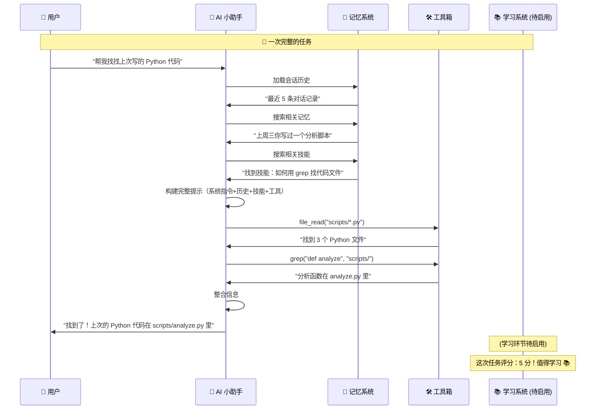

# 🧠 教你设计一个属于自己的 AI 小助手！

> 嘿，小朋友！你有没有想过，那些能回答问题、能帮你查资料、甚至能记住你喜好的 AI 是怎么做出来的？  
> 今天，我们就用一个叫 **Miniclaw**（迷你小爪 🤏）的开源项目做例子，一起看看怎么从零搭建一个"会思考、会动手、会学习"的智能小伙伴！

---

## 目录

1. [AI 小助手是什么？](#1-ai-小助手是什么)
2. [模块一：会动手——让 AI 拥有"手和脚"](#2-模块一会动手让-ai-拥有手和脚)
3. [模块二：会记忆——让 AI 拥有"大脑"](#3-模块二会记忆让-ai-拥有大脑)
4. [模块三：会学习——让 AI 越来越聪明](#4-模块三会学习让-ai-越来越聪明)
5. [把它们拼在一起！](#5-把它们拼在一起)
6. [动手试试吧！](#6-动手试试吧)

---

## 1. AI 小助手是什么？

想象一下，你有一个机器人朋友，它能看到你写的问题、能思考怎么回答、还能动手去做事情——比如帮你查文件、搜索网页、甚至写代码。

一个完整的 AI 小助手，至少需要三个本事：

| 👐 会动手 | 🧠 会记忆 | 📚 会学习 |
|:---------:|:---------:|:---------:|
| 能调用工具 | 能记住过去 | 能越变越强 |
| 读文件、搜网页、执行代码…… | 记住你上次说了什么、你喜欢什么…… | 从经验中总结规律，下次做得更好 |

下面我们一层一层来揭秘！

---

## 2. 模块一：会动手——让 AI 拥有"手和脚"

### 🤔 为什么需要工具？

大语言模型（LLM，就是 AI 的"大脑"）其实**只擅长一件事**：预测下一个字。它就像一本超级聪明的百科全书，但它不能打开你电脑上的文件，不能上网查天气，不能帮你保存笔记。

所以我们要给它配上**工具**——就像给它装上双手双脚！

### 🛠️ Miniclaw 的工具箱

Miniclaw 给 AI 配了 8 个工具，像一个瑞士军刀：

```
┌─────────────────────────────────────┐
│         🔧 Miniclaw 工具包           │
├─────────────────────────────────────┤
│ 📖 file_read    → 读文件             │
│ ✏️ file_write   → 写文件             │
│ 🖊️ file_edit    → 编辑文件            │
│ 🔍 glob         → 搜索文件名          │
│ 🔎 grep         → 搜索文件内容         │
│ 💻 bash         → 执行命令            │
│ 🐍 python       → 运行 Python 代码    │
│ 🌐 web_search   → 搜索网页            │
│ 📄 web_fetch    → 抓取网页内容         │
└─────────────────────────────────────┘
```

### 🔄 工作流程：思考 → 行动 → 观察

AI 使用工具的过程，就像科学家做实验：

```
┌─────────┐     ┌─────────┐     ┌─────────┐
│   💭     │     │   👐     │     │   👀     │
│  思考    │ ──→ │  行动    │ ──→ │  观察    │
│          │     │          │     │          │
│ "我需要  │     │ 调用     │     │ "结果    │
│  查文件" │     │ file_read│     │  是..." │
└─────────┘     └─────────┘     └─────────┘
         ←─────────────────
          如果看到新信息，继续思考
```

每一步的对话看起来像这样：

```
💬 用户：帮我看看今天的笔记写了什么？
🤖 AI 想：用户想看文件，我先用 file_read 读一下。
🤖 AI 做：file_read("notes/today.md")
📄 结果："今天我学了 AI 设计！"
🤖 AI 想：哦，内容很简单，我直接告诉用户。
🤖 AI 说：你的笔记上写着"今天我学了 AI 设计！"呢！
```

这个过程会**循环进行**——AI 可能会多次调用工具，每次拿到结果后继续思考下一步，最多 50 轮！就像你做数学题：读题 → 想一步 → 写一步 → 再看 → 再想下一步……

### 🚦 安全第一

Miniclaw 还给工具加了"安全锁"，防止 AI 做危险的事情：

- 🛑 不能执行 `rm -rf /` 这种破坏性命令
- 🛑 不能在 Python 里导入危险的系统模块
- 🛑 文件读写有大小限制

这就像告诉机器人："你可以用剪刀，但不能用它去剪电线哦！"

---

## 3. 模块二：会记忆——让 AI 拥有"大脑"

### 🤔 为什么需要记忆？

你有没有遇到过这种情况：跟 AI 说完"我叫小明"，下一句再问"我叫什么名字"，AI 就不记得了？

这是因为大语言模型本身**没有记忆**——每次对话它都是"重新开始"的！

所以我们要帮它建一个"记忆系统"。

### 🧠 Miniclaw 的三层记忆

Miniclaw 的记忆系统像一栋三层小楼：

```
       🌟 第三层：数据库（永久记忆）
          SQLite 数据库
          ┌──────────────────────┐
          │ 📝 对话记录          │
          │ 💬 LLM 交互记录      │
          │ ⚙️ 工具执行记录      │
          │ 🔍 全文搜索索引      │
          └──────────────────────┘
                       ↑
       🌟 第二层：文件快照（短期缓存）
          ┌──────────────────────┐
          │ 📄 MEMORY.md         │
          │    （项目记忆，上限约 2200 字）│
          │ 📄 USER.md           │
          │    （用户档案，上限约 1375 字）│
          └──────────────────────┘
                       ↑
       🌟 第一层：会话记忆（当前对话）
          ┌──────────────────────┐
          │ 💬 最近 5-20 条消息  │
          │    （内存中，速度最快）│
          └──────────────────────┘
```

#### 🏠 第一层：会话记忆（就像便利贴）

当前对话中，AI 会把最近 5 条消息放在"手边"——这就是**会话记忆**。它存在内存里，读取速度最快。

- 像你课桌上的便利贴：随手就能看到，但下课（对话结束）可能就丢了
- 最多保存 20 条消息，防止把 AI"撑晕"

#### 📁 第二层：文件快照（就像笔记本）

TODO: 这里的实现有问题

当新的对话开始时，AI 会从 `MEMORY.md` 和 `USER.md` 两个文件加载之前的记忆。

- 像你的笔记本：上次记下的重要事情，下次打开还能看到
- **聪明的设计**：在同一段对话中，快照内容不变。为什么？因为 LLM 有"前缀缓存"机制——如果你的提示词每次都一样，API 会给你打折（省 50-70% 费用！💰）
- 只有在对话结束时才会"刷新"快照

#### 🗄️ 第三层：数据库（就像图书馆）

所有对话、每一次 AI 的思考过程、每一次工具调用，都会被存入 SQLite 数据库。

- 像图书馆：所有资料整齐地存放着，需要时可以检索
- 用了 **FTS5 全文搜索**——就像图书管理员能瞬间找到包含某个关键词的所有书籍
- 搜索时会找出最相关的 3 条历史记录，帮 AI 回忆"以前是怎么处理类似问题的"

### 🔗 三个 Hook 点的魔法

Miniclaw 用一个叫 **Hook（钩子）** 的机制来注入记忆。想象一下，在 AI 处理任务的"流水线"上，有 9 个钩子位置，记忆系统挂在了其中最关键的几个上：

```
任务开始 → 🪝 beforeExecute（开始记录）
             → 🪝 afterStableContext（注入会话历史）
                 → 🪝 afterDynamicContext（注入搜索到的记忆 + 技能）
                     → 🪝 beforeLLMCall（检查长度）
                         → 🤖 LLM 思考
                             → 🪝 afterLLMCall（记录交互）
                                 → 有工具要调用吗？
                                   → 🪝 beforeToolCall → 🔧 执行 → 🪝 afterToolCall
                                 → 还是结束了？
任务结束 ← 🪝 afterExecute（检查是否要"学习"）
```

每个钩子就像流水线上的一个工人，在 AI 处理的不同阶段做自己的事情。这种设计非常**灵活**——如果你想加一个新功能，只需要在对应位置挂一个新的"钩子"就行了！

### ⏰ 记忆的清理

对话结束 30 分钟后，如果用户没有再说话，系统就会：

1. 把当前会话的记忆保存到文件
2. 清理内存中的临时数据
3. 等待下一次对话重新加载

就像你离开书房后，书桌会被整理干净，等待你下次回来。

---

## 4. 模块三：会学习——让 AI 越来越聪明

### 🤔 为什么需要学习？

如果 AI 每次遇到新问题都要从头思考，那它就永远不会进步。就像你做题：第一次遇到"鸡兔同笼"可能不会，学会了方法之后，下次就懂了！

Miniclaw 设计了一套**学习系统**，但目前还没完全启用——我们先看看它**可以**做到什么！

### 📈 学习流程：四步走

```
              ┌──────────────────────────┐
              │   🎯 第一步：触发判断     │
              │    这次对话值得学吗？      │
              │    打分规则：             │
              │    - 对话轮数 1-3轮 → 3分 │
              │    - 用了 2-5个工具 → 3分 │
              │    - 遇到错误并恢复了 → 2分 │
              │    - 总分 ≥ 4 才触发学习   │
              └──────────┬───────────────┘
                         ↓
              ┌──────────────────────────┐
              │   🧠 第二步：知识提取     │
              │    让 LLM 分析这段经历    │
              │    它能学到三种东西：      │
              │    📌 Skill（技能）       │
              │     → "如何做……的多步骤方法"│
              │    📌 Pattern（模式）     │
              │     → "某种问题的通用解法" │
              │    📌 Fact（事实）        │
              │     → "需要记住的持久信息" │
              └──────────┬───────────────┘
                         ↓
              ┌──────────────────────────┐
              │   💾 第三步：存入技能库    │
              │    技能被存入 SQLite，      │
              │    建立 FTS5 全文索引       │
              │    方便将来检索             │
              └──────────┬───────────────┘
                         ↓
              ┌──────────────────────────┐
              │   🔄 第四步：未来应用      │
              │    新任务来临时：          │
              │    ① 搜索技能库           │
              │    ② FTS5 匹配最相关技能   │
              │    ③ 注入到 system prompt  │
              │    ④ AI 带着"经验"开始工作 │
              └──────────────────────────┘
```

### 🎯 什么样的经历值得"学习"？

Miniclaw 使用一套**评分系统**来判断：

| 评价维度 | 得分规则 |
|---------|---------|
| 🔄 **对话深度** | 1-3 轮对话 → 3 分（高效！） |
| | 4-6 轮对话 → 2 分 |
| | 7 轮以上 → 0 分（太长了，记不住重点） |
| 🛠️ **工具使用** | 用了 2-5 个工具 → 3 分（丰富！） |
| | 只用了 1 个工具 → 1 分 |
| | 没用工具 → 0 分 |
| 🩹 **问题恢复** | 遇到错误并恢复了 → 2 分（学到了！） |
| | 没遇到错误 → 1 分（平平无奇） |
| | 遇到错误没恢复 → 0 分（失败案例） |
| **总分 ≥ 4 分 → 📚 值得学习！** |

### 💡 学到的三种知识

1. **📌 技能（Skill）**——多步骤的操作流程
   - 比如："如何用 Python 分析一个文本文件的词频"
   - 下次遇到类似任务，AI 可以直接复用这个流程

2. **📌 模式（Pattern）**——解决某类问题的通用方法
   - 比如："当用户问'对比两个文件'时，先用 file_read 读两个文件，再用 Python 做对比"
   - 这是一种"套路"，可以举一反三

3. **📌 事实（Fact）**——需要记住的特定信息
   - 比如："用户喜欢用 Python 而不是 JavaScript"
   - 或者："项目的配置文件在 config/ 目录下"

### ⚠️ 为什么学习功能还没启用？

你可能会问："这么酷的功能，为什么还没用上？"

看一下代码就明白了：

```typescript
// MemoryHooks 的构造函数
constructor(
    private memoryManager: MemoryManager,
    private sessionManager: SessionManager,
    learningStorage?: LearningStorage,  // ← 没有传入！
    llmProvider?: LLMProvider,         // ← 没有传入！
    memoryStorage?: MemoryStorage      // ← 没有传入！
) {
    // 因为没有传 learningStorage，
    // 下面的所有学习系统初始化都不执行
    if (learningStorage) { ... }
}
```

**就像造了一辆赛车，但忘了插钥匙！** 🏎️💨

这也给了我们一个重要的设计启示：**系统各个部分之间的"连接"和"初始化"同样重要**。代码写好了但没接上，等于白写。

设计者故意先不接入，可能是想：
1. 先让核心功能（工具 + 记忆）稳定运行
2. 避免低质量的学习内容"污染" AI 的系统提示
3. 先以"suggest"模式运行（仅注入上下文供参考），等验证好再切换到"auto"模式

---

## 5. 把它们拼在一起！

现在我们来看看这三个模块是怎么协同工作的——一个完整的任务处理流程：



---

## 6. 动手试试吧！

### 🎨 如果你也想设计一个 AI 小助手……

这里有一些**你可以自己尝试**的想法：

#### ✏️ 练习一：设计你的"工具包"

除了 Miniclaw 的 8 个工具，你还会给你的 AI 加什么工具？

```
我的 AI 工具包：
□ 📷 拍照识别    → 用途：________
□ 🎵 播放音乐    → 用途：________
□ 📅 日历管理    → 用途：________
□ 🌤️ 查天气     → 用途：________
□ ⏰ 设置提醒    → 用途：________
□ 📧 发送邮件    → 用途：________
□ 🧮 计算器      → 用途：________
□ 🎮 玩游戏      → 用途：________
□ ✈️ 订机票     → 用途：________
□ 🛒 购物        → 用途：________
```

#### 🧠 练习二：设计你的"记忆系统"

想一想，如果你的 AI 需要记忆这些东西，你会怎么设计？

| 要记住的东西 | 存哪里？ | 什么时候用？ |
|------------|---------|------------|
| 你的名字和年龄 | ________ | ________ |
| 上次聊到哪里了 | ________ | ________ |
| 你最喜欢的颜色 | ________ | ________ |
| 你学过的知识点 | ________ | ________ |
| 你做错的题目 | ________ | ________ |

可以试试用三个层级来分：**快速记（内存）→ 常看笔记（文件）→ 永久存储（数据库）**

#### 📚 练习三：设计你的"学习规则"

什么样的经历值得你的 AI 学习？

```
我认为值得学习的情况：
① ________________________________
② ________________________________
③ ________________________________

我认为不值得学习的情况：
① ________________________________
② ________________________________
```

对比 Miniclaw 的评分规则（≥4 分触发），你觉得你的规则怎么样？

### 🧪 挑战任务：画出你自己的架构图

用纸笔或者电脑，画出你的 AI 小助手的设计图。参考 Miniclaw 的架构：

```
我的 AI 小助手
├── 🧠 大脑：______（用什么 AI 模型？）
├── 👐 工具：
│   ├── 📖 ______
│   ├── ✏️ ______
│   └── ...（你加的）
├── 🧠 记忆：
│   ├── 第一层：______
│   ├── 第二层：______
│   └── 第三层：______
└── 📚 学习系统：
    ├── 什么时候学习：______
    ├── 学到什么：______
    └── 怎么使用学到的知识：______
```

---

## 🎯 小结

今天我们跟着 Miniclaw 项目，学到了设计一个 AI 助手的三个核心模块：

| 模块 | 核心思想 | 像什么？ |
|:----|:--------|:--------|
| 👐 **工具系统** | 给 AI 装上手和脚，让它能做事情 | 瑞士军刀 |
| 🧠 **记忆系统** | 给 AI 装上大脑，让它能记住过去 | 三层小楼（便利贴→笔记本→图书馆） |
| 📚 **学习系统** | 让 AI 能总结经验，越用越聪明 | 学生整理错题本 |

这三个模块组合起来，就是一个"会思考、会动手、会学习"的 AI 小伙伴！

---

> 📖 **你知道吗？**
>
> Miniclaw 这个名字是 **Mini**（迷你）和 **Claw**（爪子）的组合——像一只小小的机械爪，虽然不大，但什么都能抓住！
>
> 整个项目只用了约 2,000 行 TypeScript 代码，就搭建了一个完整的 AI 智能体框架。  
> 这说明——好的设计不需要很多代码，关键是想清楚**结构**和**流程**！

---

*本文基于 [Miniclaw](https://github.com/your-repo/miniclaw) 项目的设计分析编写，适合对 AI 感兴趣的小朋友和初学者阅读。*

*让我们一起，用想象力搭建未来的 AI！🚀*
