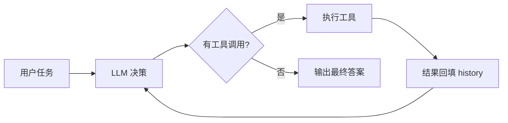
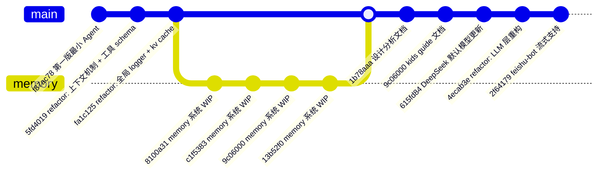
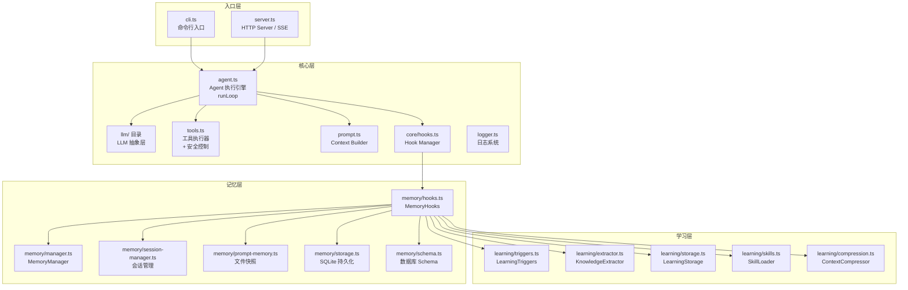
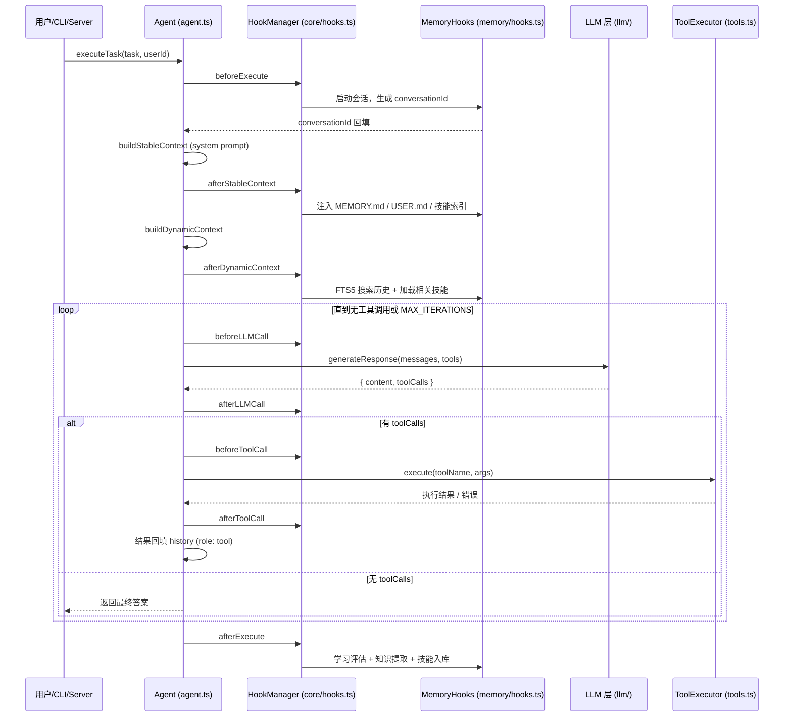

# Miniclaw 源码学习路线

> 更新日期：2026-08-03
> 目标：从零开始系统性地理解 miniclaw 代码库

---

## 1. 项目定位

**miniclaw 是一个最小化的 AI Agent（TypeScript / Node.js）**，核心设计模式是经典而典型的：



所有看似复杂的功能（记忆、学习、插件、流式）都挂在这条主循环上。

**规模**：源码约 8,700 行 TypeScript（不含 `dist/` / `node_modules/`）。

**技术栈**：TypeScript（ES2020 / CommonJS）、Node.js、`openai` SDK、`commander`（CLI）、`express`（HTTP）、`zod`（校验）、`better-sqlite3`（持久化）。

---

## 2. 项目演进脉络（git 历史）

git 历史清晰地展示了架构的逐层生长，理解它有助于读懂"新老代码并存"的现象：



演进脉络：

```
第一版最小 Agent（cli/server/agent/llm/tools）
   ↓ refactor：上下文机制 + 工具 schema + 全局 logger
memory 系统（WIP，多次迭代）── 给 agent 装"记忆"
   ↓
learning 系统（Phase 7）──────── 让 agent 从执行中"学习"
   ↓
refactor：LLM 层 ────────────── 最近的架构重构（声明式注册表）
   ↓
feishu-bot 流式支持（插件）
```

> ⚠️ 注意：由于 LLM 层经历过重构，**`src/llm.ts` 现在是薄壳，真正实现在 `src/llm/` 目录**。这是阅读时最容易踩的坑。

---

## 3. 推荐学习路线（按依赖顺序，7 步）

### 🟢 Stage 0 — 把它跑起来（30 分钟）

```bash
npm install && npm run build
node dist/cli.js "列出当前目录文件" -p deepseek -k <key>
# 或 `npm run dev` 直接起 server
```

**目的**：建立"一次任务执行"的感性认识，观察 agent 输出里的 `thinking → executing → tool_result` 阶段。

### 🟢 Stage 1 — 抓主线：一次任务的数据流

按顺序读，构成最小闭环：

| # | 文件 | 行数 | 读什么 |
|---|------|------|--------|
| 1 | `src/cli.ts` | 194 | 命令行如何组装 `AgentConfig`，最后落到 `agent.execute()` |
| 2 | `src/agent.ts` | 734 | **心脏**。重点看 `runLoop()`（L344-534）：LLM 调用 → 判断 tool_calls → 执行工具 → 回填 history → 循环，直到无工具调用或 `MAX_ITERATIONS` |
| 3 | `src/prompt.ts` | 141 | 上下文如何拼装（system prompt + 工具描述 + 用户消息） |

> 读完即理解 miniclaw 的 90% 骨架。`agent.ts` 中大量的 hook 调用（`executeAsync`）可先跳过——那是给后续模块留的"插槽"。

### 🟢 Stage 2 — LLM 层（重点，最近刚重构）

| 顺序 | 文件 | 行数 | 读什么 |
|------|------|------|--------|
| 1 | `src/llm/types.ts` | 343 | 核心类型 `Provider / Model / Context / StreamEvent` |
| 2 | `src/llm/registry.ts` | 286 | `Models` 注册表 + `createProvider()` 工厂 |
| 3 | `src/llm/providers/deepseek.ts` + `custom.ts` | 54 / 98 | 一个 provider 如何声明（baseUrl、模型、能力标志） |
| 4 | `src/llm/index.ts` | 278 | 用 `LLMProvider` 类把新架构包装成老的调用方式，保证 `agent.ts` 无需改动 |

**推荐配合读**：`docs/llm-layer-redesign.md`（问题、目标、架构写得很清晰）。

### 🟢 Stage 3 — 工具层

| 文件 | 行数 | 读什么 |
|------|------|--------|
| `src/tools-schema.ts` | 226 | 工具的 schema 定义（给 LLM 看） |
| `src/tools.ts` | 453 | 工具的实际执行 + 安全控制（危险 bash 拦截、Python 限制、超时、输出上限） |

> 对照理解：`tools-schema` 是"声明"，`tools` 是"实现"。

### 🟢 Stage 4 — Hook 架构（理解记忆/学习系统的钥匙）

| 文件 | 行数 | 读什么 |
|------|------|--------|
| `src/core/hooks.ts` | 523 | 定义 9 个钩子点（beforeExecute / afterStableContext / afterDynamicContext / beforeLLMCall / afterLLMCall / beforeToolCall / afterToolCall / afterExecute / onError） |

**为什么重要**：记忆和学习系统**不是硬编码进 agent 的**，而是通过 hook 注册进去。看懂 hook 就理解了 miniclaw 的插件化设计思想。

### 🟢 Stage 5 — 记忆系统

按内部依赖顺序读 `src/memory/`：

| 顺序 | 文件 | 行数 | 职责 |
|------|------|------|------|
| 1 | `schema.ts` | 142 | SQLite 表结构 |
| 2 | `storage.ts` | 344 | 持久化层（better-sqlite3 + FTS5 搜索） |
| 3 | `prompt-memory.ts` | 347 | 文件快照（MEMORY.md / USER.md） |
| 4 | `session-manager.ts` | 255 | 会话管理 |
| 5 | `manager.ts` | 370 | 统一门面 |
| 6 | `hooks.ts` | 404 | **入口**，把记忆系统接到 agent 的 hook 点 |

### 🟢 Stage 6 — 学习系统（Phase 7，最"智能"的部分）

读 `src/learning/`，**先读 `docs/phase-7-summary.md` 理解设计意图**：

| 文件 | 行数 | 职责 |
|------|------|------|
| `triggers.ts` | 241 | 什么时候该学习 |
| `extractor.ts` | 451 | 从对话提取知识 |
| `storage.ts` | 444 | 技能入库（skills.db + FTS） |
| `skills.ts` | 395 | 加载相关技能注入上下文 |
| `compression.ts` / `summarizer.ts` | 385 / 406 | 长上下文压缩 |

> 核心闭环：**执行完 → 触发评估 → 提取 → 存技能 → 下次任务搜相关技能注入**。

### 🟢 Stage 7 — 外围

| 文件 / 目录 | 读什么 |
|------|------|
| `src/server.ts`（345 行） | HTTP + SSE 流式，`/execute/stream` 如何转发 `ProgressEvent` |
| `src/logger.ts` | 全局日志 |
| `plugins/` | feishu-bot、duckduckgo-search 两个真实插件，看外部系统怎么用 miniclaw |
| `test/` | 现有的测试文件（agent / memory / learning / core 各目录），倒着读测试也是很好的理解方式 |

---

## 4. 总体架构



---

## 5. 一次任务执行的完整时序



---

## 6. 避坑提示

1. **`src/llm.ts` 是兼容壳**，新代码都在 `src/llm/` 目录里。`AGENTS.md` 已经过时——它还写着"无测试套件"，且对 llm.ts 的描述是基于旧实现的。
2. **`agent.ts` 里 `MAX_ITERATIONS` 实际是 50**（不是 `AGENTS.md` 里写的 10）。
3. **一次调用要理解两层协议**：agent 与 LLM 之间用 OpenAI 风格 `tool_calls`；`llm/` 内部有统一的 `StreamEvent` 协议，`llm/index.ts` 负责两者互转。
4. **记忆和学习是"可选增强"**：`AgentConfig` 里 `enableMemory` / `enableLearning` 默认开启，但主体循环不依赖它们——读主线时先忽略。
5. **阅读顺序建议**：主线（Stage 1）→ LLM（Stage 2）→ Hook（Stage 4）→ 记忆（Stage 5）→ 学习（Stage 6），工具层与 Prompt 层可穿插理解。

---

## 7. 配套文档索引

| 文档 | 内容 |
|------|------|
| `docs/design-analysis.md` | 总体架构分析（Prompt 设计、记忆管理、可优化点） |
| `docs/llm-layer-redesign.md` | LLM 层重构设计（问题、目标、架构） |
| `docs/phase-7-summary.md` | 学习系统（Phase 7）实施方案摘要 |
| `docs/phase-7-design.md` | 学习系统详细设计 |
| `docs/kids-guide-to-agent-design.md` | 面向初学者的趣味讲解（"会动手 / 会记忆 / 会学习"） |
