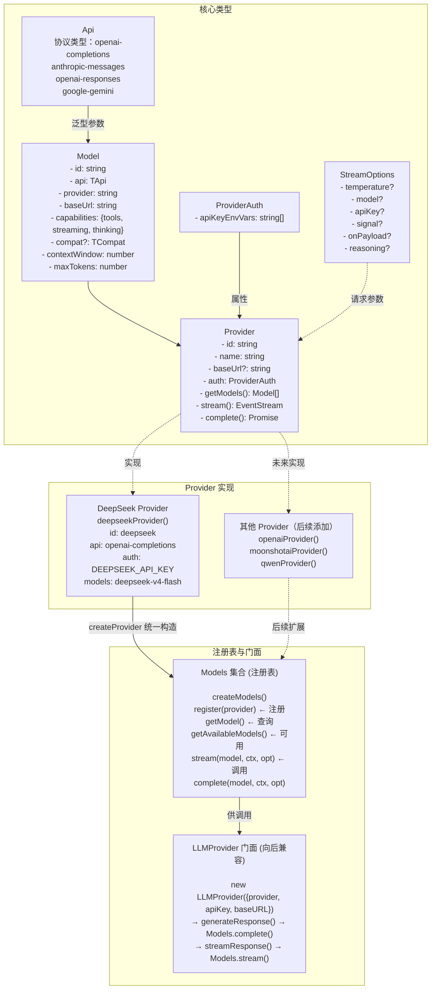
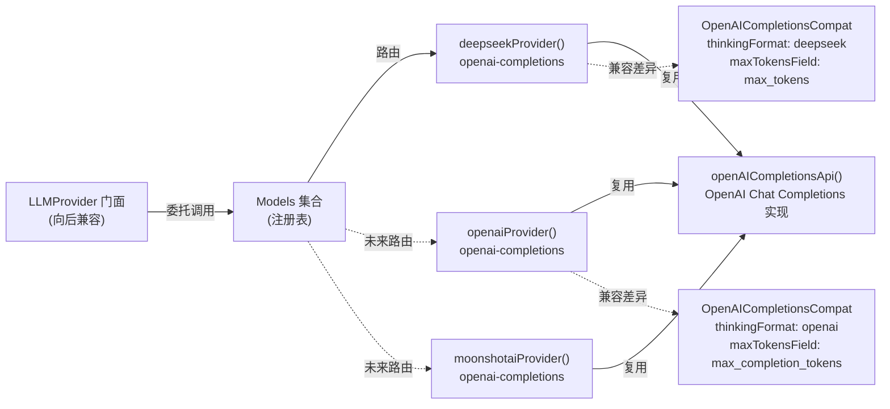

# LLM 层重构架构设计文档

**版本:** 1.0
**日期:** 2026-07-30
**状态:** Draft
**参考项目:** [pi-ai](https://github.com/earendil-works/pi) by earendil-works

---

## 目录

1. 概述
2. 需求总结
3. 核心概念
4. 架构概览
5. 系统模块设计
6. 接口设计
7. 数据设计
8. 非功能性设计
9. 技术栈
10. 实施计划
11. 风险与待决事项

---

## 1. 概述

### 1.1 项目背景

`src/llm.ts` 是 miniclaw 的 LLM Provider 抽象层，封装了与不同 LLM 服务商（OpenAI、DeepSeek、Kimi、Qwen）的交互。当前实现存在以下问题：

- **硬编码配置**：Provider 的 base URL、默认模型名、temperature 都在 switch 语句中写死
- **扩展困难**：添加新 provider 需要修改 3 处 switch 语句（base URL、模型名、API key 回退）
- **API key 回退逻辑单一**：只回退到 `process.env.OPENAI_API_KEY`，不管实际用哪个 provider
- **无流式支持**：只有 `generateResponse`，没有 `streamResponse`
- **无请求级配置**：所有参数在构造函数设死，无法单次调用覆盖 model/temperature 等
- **无 Provider 能力声明**：不知道哪些 provider 支持 tools/streaming/reasoning
- **两套不兼容的 LLMProvider 类型**：`src/llm.ts` 的 class 和 `src/memory/prompt-memory.ts` 的 interface 不兼容
- **无 .env 加载**：没有 `dotenv`，用户需要手动 export 环境变量

### 1.2 核心目标

- 将硬编码的 provider 配置（base URL、模型名、env var 等）提取为声明式注册表
- 定义清晰的抽象接口，支持多 provider 扩展（符合开闭原则）
- 支持流式响应（EventStream 协议）
- 支持请求级参数覆盖（model、temperature、api key 等）
- 提供 Provider 能力声明（tools/streaming/thinking 支持情况）
- 统一 `prompt-memory.ts` 中的 LLMProvider 接口
- 添加配置文件加载支持（.env + JSON）
- 保持向后兼容，现有 `Agent` 构造方式不变

### 1.3 关键约束

| 约束类型 | 描述 |
|---------|------|
| 向后兼容 | `new LLMProvider({provider, apiKey, baseURL})` 必须继续可用 |
| 增量实施 | 允许先只实现 DeepSeek provider，后续逐步添加 |
| 无新增运行时依赖 | 仅添加 `dotenv`（已为 devDependency），避免引入重量级框架 |
| Provider 不可用时优雅降级 | 不中断现有逻辑 |
| 日志复用 | 使用已有的 `src/logger.ts` 模块，不引入新日志框架 |

---

## 2. 需求总结

### 2.1 功能性需求

| 编号 | 需求 | 优先级 | 说明 |
|------|------|--------|------|
| FR-001 | Provider 声明式注册 | P0 | provider 的 base URL、默认模型、auth 方式等通过声明式配置定义，而非 switch 语句 |
| FR-002 | 请求级参数覆盖 | P0 | 每次调用可覆盖 model、temperature、apiKey、baseUrl 等参数 |
| FR-003 | 工具调用支持 | P0 | provider 需支持 function/tool calling |
| FR-004 | 流式响应 | P0 | 支持 streaming 模式，通过事件协议推送 text/thinking/toolcall 块 |
| FR-005 | 配置加载 | P1 | 支持 .env + JSON 配置文件，定义多层覆盖顺序 |
| FR-006 | Provider 能力声明 | P1 | 每个 provider 声明是否支持 tools/streaming/thinking |
| FR-007 | LLM 调用日志 | P1 | 记录每次调用的请求、响应、token 使用、cache 信息 |
| FR-008 | 自定义 Provider | P2 | 允许用户通过配置文件或运行时注册自定义 OpenAI 兼容 API |

### 2.2 非功能性需求

| 编号 | 需求 | 目标值 |
|------|------|--------|
| NFR-001 | 向后兼容 | 现有 Agent 构造方式 100% 可用 |
| NFR-002 | 新增 provider 成本 | 添加新 provider 只需 1 个文件，不改现有代码 |
| NFR-003 | 日志完整性 | 每次 LLM 调用完整记录输入输出、token 使用、耗时 |

---

## 3. 核心概念

### 3.1 工厂模式

**工厂模式** 是一种创建型设计模式，核心思想是：**不直接 `new` 对象，而是调用一个函数来创建对象**。

#### 反例：不用工厂（当前做法）

```typescript
class LLMProvider {
  constructor(config: LLMConfig) {
    switch (config.provider) {          // switch 1: base URL
      case 'deepseek': baseURL = 'https://api.deepseek.com'; break;
      case 'kimi':     baseURL = 'https://api.moonshot.cn/v1'; break;
    }
    this.client = new OpenAI({ ... });
  }
  private getModelName() {
    switch (this.config.provider) {     // switch 2 + 3: 模型名
      case 'deepseek': return 'deepseek-v4-flash';
    }
  }
}
```

**问题**：添加新 provider = 修改多处 switch 语句，违反开闭原则。

#### 正例：用工厂（pi 做法）

```typescript
// providers/deepseek.ts — 每个 provider 是独立工厂函数
export function deepseekProvider(): Provider<"openai-completions"> {
  return createProvider({
    id: "deepseek",
    name: "DeepSeek",
    baseUrl: "https://api.deepseek.com",
    auth: { apiKeyEnvVars: ["DEEPSEEK_API_KEY"] },
    models: DEEPSEEK_MODELS,
    api: openAICompletionsApi(),  // 复用 OpenAI Chat Completions 实现
  });
}
```

**好处**：
- 添加 provider 只需写一个新工厂，注册到 `Models` 集合
- 每个 provider **自包含**：id、baseURL、auth、models、API 实现都在一个文件
- 对同一 API 协议（如 `openai-completions`）的 provider 可复用 stream 实现

### 3.2 Api 类型路由

Api 类型决定了使用哪个 API 协议实现：

| Api 类型 | 协议 | 适用 Provider |
|----------|------|---------------|
| `openai-completions` | OpenAI Chat Completions API | DeepSeek、Kimi、Qwen 等 OpenAI 兼容 API |
| `anthropic-messages` | Anthropic Messages API | 预留 |
| `openai-responses` | OpenAI Responses API | 预留 |
| `google-gemini` | Google Gemini API | 预留 |

同一 provider 可以有多个 API 协议，不同 provider 可以共享同一 API 协议。

### 3.3 Model 作为数据对象

当前模型只是一个字符串（`"gpt-4o-mini"`）。新设计中 Model 是携带完整元数据的对象：

```typescript
interface Model<TApi> {
  id: string;           // "deepseek-v4-flash"
  name: string;         // "DeepSeek V4 Flash"
  api: TApi;            // "openai-completions" → 路由到正确的 stream 实现
  provider: string;     // "deepseek"
  baseUrl: string;      // 模型对应的 API 端点
  capabilities: {
    tools: boolean;     // 是否支持 tool calling
    streaming: boolean; // 是否支持流式
    thinking: boolean;  // 是否支持推理/思考
  };
  compat?: OpenAICompletionsCompat;  // 兼容性 flags
  contextWindow: number;  // 上下文窗口大小
  maxTokens: number;      // 最大输出 token 数
}
```

---

## 4. 架构概览

### 4.1 架构风格

**选型:** Provider 工厂 + Api 类型路由 + 注册表模式

**理由:**
- pi 的设计验证了这套模式在支持 40+ provider 时的可扩展性
- 工厂函数使每个 provider 自包含，便于独立测试
- Api 类型路由在编译期保证协议一致性
- 注册表（Models 集合）解耦了 provider 创建和调用

### 4.2 核心类型关系图



**图例说明**：
- `-->` 类型依赖/参数化关系
- `-.->` 非直接继承的实现关系

### 4.3 关键架构决策

| 决策编号 | 决策 | 选项 | 选定方案 | 理由 |
|---------|------|------|---------|------|
| AD-001 | Provider 创建方式 | `new` class vs 工厂函数 | **工厂函数** | 每个 provider 自包含，可独立测试 |
| AD-002 | Model 表示 | 字符串 vs 数据对象 | **数据对象** | 携带 api/baseUrl/capabilities/compat |
| AD-003 | API 协议区分 | switch 语句 vs 类型路由 | **类型路由** | 编译期检查，天然支持不同协议 |
| AD-004 | 兼容性处理 | if/else 硬编码 vs 声明式 flags | **声明式 flags** | 新增差异只需加 flag，不改代码 |
| AD-005 | Auth 管理 | 全局 env var vs provider 级 | **provider 级** | 每个 provider 声明自己的 env var |
| AD-006 | 配置加载 | 仅 env var vs 多层配置 | **多层配置** | 支持 .env + JSON + CLI + 运行时 |

### 4.4 配置加载顺序

```
硬编码默认值 (Provider 工厂内部的 baseUrl / model)
  ↓
.env 文件 (dotenv 加载)
  ↓
miniclaw.json / miniclaw.yaml 配置文件
  ↓
环境变量 (DEEPSEEK_API_KEY、LLM_API_KEY 等)
  ↓
CLI 参数 (--provider、--llm-api-key、-b)
  ↓
运行时注册 (registerProvider())
```

---

## 5. 系统模块设计

### 5.1 文件结构

```
src/
├── llm/
│   ├── index.ts              # 公开门面 + 向后兼容的 LLMProvider 类
│   ├── types.ts              # 核心类型定义
│   ├── registry.ts           # Models 集合 + createProvider()
│   └── providers/
│       ├── deepseek.ts       # deepseekProvider()（当前唯一实现）
│       ├── [openai.ts]       # 后续实现
│       ├── [kimi.ts]         # 后续实现
│       └── [qwen.ts]         # 后续实现
├── llm.ts                    # 向后兼容 re-export
├── agent.ts                  # 使用新 Models 接口（少量改动）
├── cli.ts                    # 新增 --config、--list-providers
└── memory/
    ├── prompt-memory.ts      # 统一 LLMProvider 接口
    └── hooks.ts              # 使用统一类型
```

### 5.2 核心模块职责

#### `llm/types.ts` — 核心类型定义

| 类型 | 说明 |
|------|------|
| `Api` / `KnownApi` | API 协议类型（openai-completions、anthropic-messages） |
| `Provider<TApi>` | Provider 接口（auth、getModels、stream、complete） |
| `Model<TApi>` | 模型数据对象（api、provider、capabilities、compat） |
| `ProviderAuth` | Auth 声明（apiKeyEnvVars） |
| `StreamOptions` | 请求级参数（temperature、apiKey、signal、onPayload） |
| `OpenAICompletionsCompat` | OpenAI 兼容 API 差异声明 |
| `Context` / `Message` / `ContentBlock` | 统一消息格式 |
| `StreamEvent` | 事件流协议（text_delta、toolcall_start 等） |
| `EventStream` | 事件流接口（asyncIterator、result、forEach） |

#### `llm/registry.ts` — Provider 注册表

`Models` 集合负责管理 provider 注册和统一调用入口：

```typescript
interface Models {
  register(provider: Provider): void;
  getProvider(id: string): Provider | undefined;
  getModel(provider: string, id: string): Model | undefined;
  getAvailableModels(): Promise<readonly Model[]>; // 只返回已配置的
  stream(model, context, options): EventStream;
  complete(model, context, options): Promise<AssistantMessage>;
}
```

`createProvider()` 是统一工厂函数，将 id/name/baseUrl/auth/models/api 组装为 Provider 对象。

#### `llm/providers/deepseek.ts` — DeepSeek 工厂（当前唯一）

```typescript
export function deepseekProvider(): Provider<"openai-completions"> {
  return createProvider({
    id: "deepseek",
    name: "DeepSeek",
    baseUrl: "https://api.deepseek.com",
    auth: { apiKeyEnvVars: ["DEEPSEEK_API_KEY"] },
    models: [
      {
        id: 'deepseek-v4-flash',
        name: 'DeepSeek V4 Flash',
        api: 'openai-completions',
        provider: 'deepseek',
        baseUrl: 'https://api.deepseek.com',
        capabilities: { tools: true, streaming: true, thinking: true },
        compat: { thinkingFormat: 'deepseek' },
        contextWindow: 65536,
        maxTokens: 8192,
      },
    ],
    api: openAICompletionsApi(),
  });
}
```

#### `llm/index.ts` — 向后兼容门面

```typescript
class LLMProvider implements LLMProviderInterface {
  constructor(config: LLMConfig) {
    // 查 Models 获取 Provider + Model
  }
  generateResponse(messages, tools, params?) {
    // 内部调 Models.complete()
  }
  streamResponse(messages, tools, onEvent, params?) {
    // 内部调 Models.stream()
  }
}
```

---

## 6. 接口设计

### 6.1 Provider 接口

```typescript
interface Provider<TApi extends Api = Api> {
  readonly id: string;
  readonly name: string;
  readonly baseUrl?: string;
  readonly auth: ProviderAuth;

  getModels(): readonly Model<TApi>[];
  stream(model, context, options): EventStream;
  complete?(model, context, options): Promise<AssistantMessage>;
}
```

`stream()` 是核心 I/O 方法。`complete()` 是便利方法，内部调 `stream()` 聚合结果。

### 6.2 Models 集合（统一调用入口）

```typescript
interface Models {
  register(provider: Provider): void;
  getProviders(): readonly Provider[];
  getProvider(id: string): Provider | undefined;
  getModels(provider?: string): readonly Model[];
  getModel(provider: string, id: string): Model | undefined;
  getAvailableModels(): Promise<readonly Model[]>;
  stream(model, context, options): EventStream;
  complete(model, context, options): Promise<AssistantMessage>;
}
```

#### Models.complete() 实现 — 含日志

```typescript
async complete(model, context, options): Promise<AssistantMessage> {
  const requestId = logCallStart(model, context, options);
  const startTime = Date.now();
  try {
    const result = await this.stream(model, context, options).result();
    logCallComplete(requestId, result, Date.now() - startTime);
    return result;
  } catch (error) {
    logCallError(requestId, error as Error, Date.now() - startTime);
    throw error;
  }
}
```

### 6.3 LLMProvider 门面（向后兼容）

```typescript
interface LLMProviderInterface {
  readonly provider: string;
  generateResponse(
    messages: ChatMessage[],
    toolsParam?: Record<string, unknown>[],
    params?: CompletionParams,
  ): Promise<{ content: string; toolCalls: unknown[] | null }>;
  streamResponse(
    messages: ChatMessage[],
    toolsParam: Record<string, unknown>[] | undefined,
    onEvent: (event: StreamEvent) => void,
    params?: CompletionParams,
  ): Promise<AssistantMessage>;
}
```

`generateResponse()` 维持与旧 `src/llm.ts` 兼容的签名和返回值。

### 6.4 Provider 间关系



---

## 7. 数据设计

### 7.1 事件流协议

```typescript
type StreamEvent =
  | { type: 'start'; partial: AssistantMessage }

  // Text blocks
  | { type: 'text_start'; contentIndex: number; partial: AssistantMessage }
  | { type: 'text_delta'; contentIndex: number; delta: string; partial: AssistantMessage }
  | { type: 'text_end'; contentIndex: number; content: string; partial: AssistantMessage }

  // Thinking blocks
  | { type: 'thinking_start'; contentIndex: number; partial: AssistantMessage }
  | { type: 'thinking_delta'; contentIndex: number; delta: string; partial: AssistantMessage }
  | { type: 'thinking_end'; contentIndex: number; content: string; partial: AssistantMessage }

  // Tool call blocks
  | { type: 'toolcall_start'; contentIndex: number; id: string; name: string; partial: AssistantMessage }
  | { type: 'toolcall_delta'; contentIndex: number; delta: string; partial: AssistantMessage }
  | { type: 'toolcall_end'; contentIndex: number; toolCall: ToolCallContent; partial: AssistantMessage }

  // Terminal events
  | { type: 'done'; message: AssistantMessage }
  | { type: 'error'; error: string; message?: AssistantMessage };
```

每个事件携带 `partial` 字段（当前累积的 `AssistantMessage`），消费者可以随时获取已完成部分。

### 7.2 LLM 调用日志数据模型

```typescript
interface LLMCallLog {
  // ─── 调用标识 ──────────────────────────────────
  requestId: string;
  taskId?: string;
  conversationId?: string;

  // ─── 请求信息 ───────────────────────────────────
  provider: string;
  model: string;
  messages: Array<{ role: string; length: number }>;
  toolCount?: number;
  isFallback?: boolean;

  // ─── Token 使用 ─────────────────────────────────
  usage?: {
    promptTokens: number;
    completionTokens: number;
    totalTokens: number;
    cacheReadTokens: number;     // KV Cache 命中
    cacheWriteTokens?: number;   // KV Cache 写入
    reasoningTokens?: number;    // 推理 token
  };

  // ─── 性能 ────────────────────────────────────────
  durationMs: number;
  isStreaming: boolean;
  isRetry?: boolean;
  retryCount?: number;

  // ─── 响应摘要 ────────────────────────────────────
  contentPreview?: string;       // 前 200 字符
  toolCalls?: Array<{ name: string }>;
  stopReason?: string;

  // ─── 错误 ─────────────────────────────────────────
  error?: string;
}
```

### 7.3 日志记录点

在 `Models.complete()` 和 `Models.stream()` 中分三阶段记录：

| 阶段 | 函数 | 日志级别 | 记录内容 |
|------|------|----------|----------|
| 调用开始 | `logCallStart()` | `INFO` | requestId、provider、model、消息摘要、工具数量 |
| 调用完成 | `logCallComplete()` | `INFO` | duration、usage（含 cache 信息）、stopReason、工具调用摘要 |
| 调用失败 | `logCallError()` | `ERROR` | error.message、stack |
| 工具回退 | `logToolFallback()` | `WARN` | 降级原因、模型名 |

### 7.4 日志输出示例

```
[2026-07-30T10:30:00.123Z] [INFO] [LLM] Call started {
  "requestId": "llm_req_abc123",
  "provider": "deepseek",
  "model": "deepseek-v4-flash",
  "messages": [
    { "role": "system", "length": 845 },
    { "role": "user", "length": 234 }
  ],
  "toolCount": 8
}

[2026-07-30T10:30:05.456Z] [INFO] [LLM] Call completed {
  "requestId": "llm_req_abc123",
  "durationMs": 4333,
  "usage": {
    "promptTokens": 1250,
    "completionTokens": 340,
    "cacheReadTokens": 845,
    "totalTokens": 1590
  },
  "stopReason": "toolUse",
  "contentPreview": "I'll help you analyze the code...",
  "toolCalls": [{ "name": "file_read" }, { "name": "grep" }]
}
```

---

## 8. 非功能性设计

### 8.1 向后兼容

`src/llm.ts` 中的 `LLMProvider` 类在新架构中通过 `src/llm/index.ts` 门面类保持完全兼容：

```
new LLMProvider({ provider, apiKey, baseURL })
  → 内部查 Models 获取 Provider + Model
  → generateResponse() → Models.complete()
  → 返回 { content, toolCalls }（与旧接口完全一致）
```

### 8.2 可扩展性

添加新 provider 只需两步：

1. 创建工厂文件（如 `providers/anthropic.ts`）
2. 注册到 Models：`models.register(anthropicProvider())`

无需修改任何现有代码。用户也可通过 `miniclaw.json` 配置添加自定义 OpenAI 兼容 provider。

### 8.3 Auth 管理

每个 provider 声明自己的环境变量：

```typescript
interface ProviderAuth {
  apiKeyEnvVars: string[];  // 如 ["DEEPSEEK_API_KEY"]
}
```

系统自动发现已配置的 provider（`getAvailableModels()` 只返回 auth 已配置的模型）。

### 8.4 日志级别策略

| 场景 | 级别 | 说明 |
|------|------|------|
| 调用开始 | `INFO` | 记录请求基本信息，用于追踪链路 |
| 调用成功 | `INFO` | 记录完整调用结果，用于审计和成本分析 |
| 调用失败 | `ERROR` | 记录错误详情，用于故障排查 |
| 工具回退 | `WARN` | 记录降级事件，用于兼容性监控 |
| Token 异常 | `WARN` | 记录异常情况，用于调试 |

### 8.5 与 pi 的关键差异

| 维度 | pi | miniclaw |
|------|----|----------|
| 规模 | 40+ provider, 500+ 模型 | 1 provider 起步，后续扩展 |
| 模型源 | 动态刷新 + 编译时生成目录 | 静态预定义 |
| Auth | API key + OAuth + CredentialStore | 简化为 env var + 配置 |
| Provider 注册 | 编译时 + 运行时 | 纯运行时 |
| 目标 | 通用 LLM API 库 | 单一 agent 的 LLM 层 |

---

## 9. 技术栈

| 层次 | 技术 | 版本 | 用途 | 选型理由 |
|------|------|------|------|---------|
| 运行时 | Node.js | >=18 | 执行环境 | miniclaw 已有 |
| 语言 | TypeScript | 5.x | 类型安全 | miniclaw 已有 |
| LLM SDK | openai | 4.x | OpenAI Chat Completions API 调用 | miniclaw 已有 |
| 配置加载 | dotenv | (新增) | .env 文件加载 | 行业标准，零依赖 |
| 日志 | src/logger.ts | 内置 | 结构化日志 | 复用现有模块 |

---

## 10. 实施计划

### Phase 1: 核心类型 + DeepSeek 工厂（非破坏性）

1. 创建 `src/llm/types.ts` — 核心类型定义
2. 创建 `src/llm/registry.ts` — `Models` 集合 + `createProvider()`
3. 创建 `src/llm/providers/deepseek.ts` — DeepSeek 工厂
4. 创建 `src/llm/index.ts` — 向后兼容门面
5. 旧 `src/llm.ts` 转为 re-export

### Phase 2: 流式支持

6. 实现通用 `streamOpenAICompletions()` + EventStream
7. Agent 添加流式执行能力

### Phase 3: Auth + 配置

8. 添加 `dotenv` 依赖 + `.env.example`
9. 实现 `miniclaw.json` 配置文件加载
10. 实现 `env-api-keys` 自动发现

### Phase 4: 消费者适配

11. 统一 `prompt-memory.ts` 的 LLMProvider 接口
12. 更新 `hooks.ts`、`extractor.ts`
13. CLI 添加 `--config`、`--list-providers`

---

## 11. 风险与待决事项

### 11.1 风险登记

| 编号 | 风险 | 影响范围 | 影响 | 可能性 | 缓解措施 |
|------|------|---------|------|--------|---------|
| R-001 | 重构引入回归 bug，影响现有 agent 执行 | Agent 执行流程 | 高 | 低 | Phase 1 不改变 generateResponse 逻辑，仅重构内部实现 |
| R-002 | 流式实现在某些 provider 上不兼容 | 流式功能 | 中 | 低 | 通过 compat flags 声明差异，不兼容时回退到非流式 |
| R-003 | 日志输出过多，影响性能 | 系统整体 | 低 | 中 | 日志级别控制，INFO 级别以上不影响关键路径 |
| R-004 | prompt-memory.ts 的 LLMProvider 接口统一后影响 memory 功能 | Memory 系统 | 中 | 低 | interface 统一后所有调用点同步更新 |

### 11.2 待决事项

| 编号 | 事项 | 描述 |
|------|------|------|
| TBD-001 | DeepSeek v4 的 thinking 参数格式 | 需要确认 `thinkingFormat: "deepseek"` 的具体参数格式 |
| TBD-002 | 配置文件名 | 使用 `miniclaw.json` 还是 `miniclaw.config.json` |

---

## 12. 实施状态

### 已完成（Phase 1-3）

| 阶段 | 内容 | 状态 |
|------|------|------|
| Phase 1 | 核心类型 (`src/llm/types.ts`) | ✅ |
| Phase 1 | Provider 注册表 (`src/llm/registry.ts`) | ✅ |
| Phase 1 | DeepSeek 工厂 (`src/llm/providers/deepseek.ts`) | ✅ |
| Phase 1 | 通用 OpenAI 兼容工厂 (`src/llm/providers/custom.ts`) | ✅ |
| Phase 1 | 向后兼容门面 (`src/llm/index.ts`)，旧 `src/llm.ts` 转为 re-export | ✅ |
| Phase 2 | 流式实现 (`src/llm/streams/openai-completions.ts` + `event-stream.ts`) | ✅ |
| Phase 3 | dotenv + `.env.example` | ✅ |
| Phase 3 | 配置文件加载 (`src/llm/config.ts` + `miniclaw.json.example`) | ✅ |
| Phase 3 | 环境变量发现 (`src/llm/env-api-keys.ts`) | ✅ |
| Phase 3 | CLI 增强：`providers` 命令、`--config`、显式退出 | ✅ |

### 待办（Phase 4）

| 阶段 | 内容 | 状态 |
|------|------|------|
| Phase 4 | 统一 `prompt-memory.ts` 的 LLMProvider 接口 | ⏳ |
| Phase 4 | 更新 `hooks.ts`、`extractor.ts` 使用统一类型 | ⏳ |
| Phase 4 | Agent 流式执行能力集成（`runLoop` 使用 `streamResponse`） | ⏳ |
| 扩展 | 添加 OpenAI、Kimi、Qwen 等专用工厂 | ⏳ |

### 验证结果

- `npx tsc --noEmit` ✅ 编译通过
- `npm test` ✅ 245/245 测试通过
- 真实 DeepSeek 调用 ✅（含 KV cache `cacheReadTokens` 与推理 `reasoningTokens` 日志）
- 配置文件自定义 provider 注册 ✅
- CLI `execute` 与默认命令 ✅（显式退出修复了内存句柄导致的挂起）

---

**文档版本**: 1.1
**日期**: 2026-08-01
**参考项目**: [pi-ai](https://github.com/earendil-works/pi) by earendil-works
**状态**: Phase 1-3 已实施
