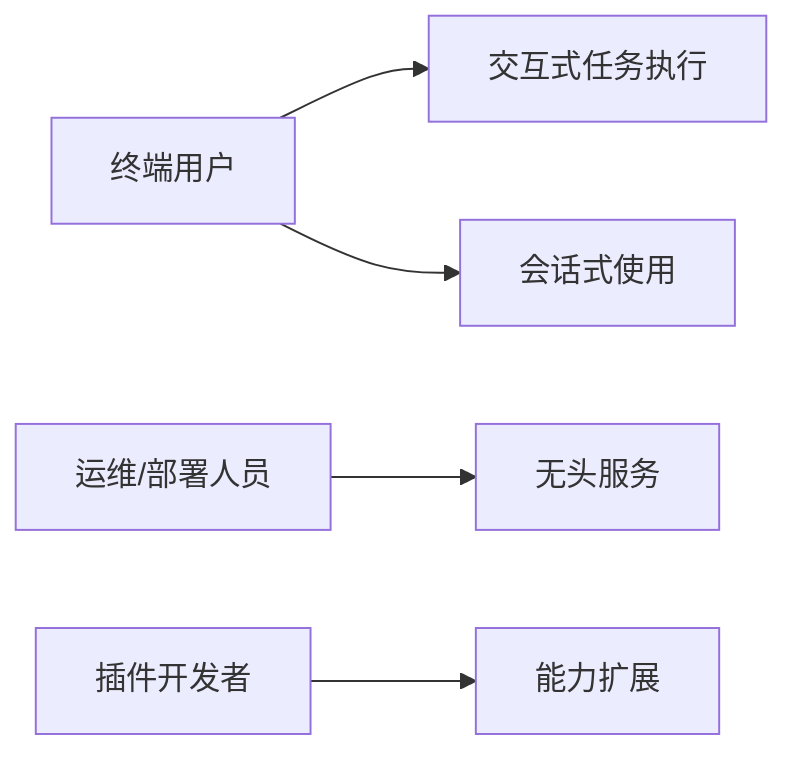
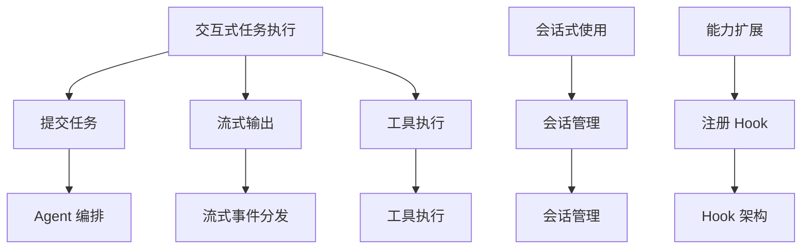

# PRD 分析报告

**源文档:** miniclaw 双界面架构需求（内联文本）
**分析日期:** 2026-08-23

---

## 1. 利益相关方

| 利益相关方 | 核心诉求 |
|-----------|----------|
| 终端用户（开发者）| 能用 Web 或 TUI 舒适地使用 agent，实时看到 LLM token 流 / thinking / 工具执行进度，可中途取消任务 |
| 运维/部署人员 | 支持无头部署（仅 API/Web 服务），配置简单，认证安全，并发可控 |
| 插件/扩展开发者 | 能基于 hook 架构接入 UI 无关的功能（记忆、技能、监控），不被界面耦合 |
| miniclaw 核心开发者 | 核心（Agent/LLM/记忆）保持 UI 无关，界面模块可插拔、可独立演进 |

## 2. 价值流

| 价值流 | 起点 | 终点 | 关键阶段 | 服务对象 |
|--------|------|------|----------|----------|
| 交互式任务执行 | 用户输入任务 | 用户获得最终结果并可见全过程 | 提交 → 流式输出（thinking/token/tool）→ 工具执行 → 完成/取消 | 终端用户 |
| 会话式使用 | 用户开始会话 | 会话上下文可追溯、可恢复 | 建会话 → 多轮对话 → 历史恢复 | 终端用户 |
| 无头服务 | 外部调用 API | 拿到结构化结果 | 鉴权 → 执行 → 返回/推送 | 运维/其他系统 |
| 能力扩展 | 开发者写插件 | 插件功能在任意界面生效 | 注册 hook → 拦截事件 → 生效 | 插件开发者 |

## 3. 业务能力地图

```
UI 层（可插拔）
├── Web UI 渲染
├── TUI 渲染
└── 远程 UI 客户端（浏览器）

通信层
├── 流式事件分发（token / thinking / tool 进度）
├── 任务控制（提交 / 取消 / 状态查询）
├── 会话管理（历史 / 恢复）
└── 认证与授权

核心层（UI 无关）
├── Agent 编排（runLoop / executeTask）
├── LLM 提供者（provider factory / 流式协议）
├── 工具执行
├── 记忆系统（memory / session-manager）
└── Hook 架构（beforeLLMCall / afterToolCall ...）
```

## 4. 功能性需求

| 编号 | 需求 | 优先级 | 说明 |
|------|------|--------|------|
| FR-001 | Web UI（浏览器端）| P0 | 任务输入、流式输出、工具进度、结果展示 |
| FR-002 | TUI（终端交互）| P0 | 同上，终端内交互式体验 |
| FR-003 | 界面模块可插拔集成 | P0 | Web/TUI 作为独立模块挂到同一核心，可单独启用 |
| FR-004 | 实时流式输出 | P0 | LLM token 流、thinking、tool 执行进度实时推送 |
| FR-005 | 主程序与 UI 通信协议 | P0 | 统一的进程内/进程间通信方式 |
| FR-006 | 任务取消 | P1 | UI 可中断正在执行的任务（复用 AbortSignal）|
| FR-007 | 会话历史与恢复 | P1 | 跨界面共享会话记录 |
| FR-008 | 无头 API 模式保留 | P1 | 现有 REST/SSE 接口继续可用，作为 Web 的后端 |
| FR-009 | 认证 | P1 | Web/API 接入需鉴权 |
| FR-010 | 插件/记忆在任意界面生效 | P2 | hook 事件对所有 UI 一致 |

## 5. 非功能性需求

| 编号 | 需求 | 目标值 | 说明 |
|------|------|--------|------|
| NFR-001 | 首 token 延迟 | < 1.5s [ASSUMPTION] | 流式路径不经过聚合缓冲 |
| NFR-002 | 核心 UI 无关 | 核心层零 UI 依赖 | Agent/llm/memory 不 import 任何 UI 模块 |
| NFR-003 | 并发任务 | 现有 maxConcurrent 语义保留 [ASSUMPTION] | TUI 单任务 + Web 多任务可并存 |
| NFR-004 | 事件吞吐 | 每条 delta 独立转发 [ASSUMPTION] | 不合并、不丢事件 |
| NFR-005 | 可测试性 | 核心+通信层可用脚本/CI 测试 | UI 与逻辑解耦 |

## 6. 业务约束

| 约束类型 | 描述 |
|---------|------|
| 技术栈 | TypeScript / Node / CommonJS，tsc 编译到 dist |
| 现有资产 | express 服务（REST+SSE）、commander CLI、hook 架构、provider factory、SSE 已有雏形 |
| 团队规模 | 未提及 |
| 时间线 | 未提及 |
| 合规要求 | 未提及（认证是自设的 Bearer Token）|

## 7. 假设与依赖

- [ASSUMPTION] TUI 技术栈未定（Ink/react-terminal 或 blessed 待选）
- [ASSUMPTION] Web UI 可能是 SPA（如 React/Vue）也可能是服务端渲染静态页
- [ASSUMPTION] 单机部署为主，进程内通信优先，进程间通信（如有）基于本地 socket/HTTP
- [ASSUMPTION] 用户希望保留现有 REST/SSE API 形态（已有 /execute/stream 雏形）

## 8. 缺口与歧义

- [GAP] **流式事件断层**：`llm/` 层已有 `StreamEvent`（text_delta/thinking_delta/toolcall_delta），但 `Agent.runLoop` 走的是聚合的 `generateResponse`，`onProgress` 只有 4 个粗粒度 stage——实时 token 流链路尚未打通，这是双界面架构最关键的前提
- [GAP] TUI 具体技术选型未定（Ink / blessed / 其他）
- [GAP] Web UI 形态未定（纯静态 SPA 还是 SSR）
- [GAP] 认证模型：现有 Bearer Token 是否足够；Web 端是否需要登录/多用户
- [GAP] 任务取消机制：`StreamOptions.signal` 已支持 AbortSignal，但 agent/server 层未暴露取消 API
- [GAP] 会话持久化：memory 有 session-manager，但 agent/server 尚未把任务与会话 ID 显式绑定暴露给 UI
- [GAP] 并发语义：TUI 与 Web 同时使用时的任务隔离/队列规则未定义
- [GAP] 部署形态：TUI 是否要求常驻 daemon 与 Web 共存，还是各自独立进程

## 附录 A：利益相关方-价值流映射图



## 附录 B：价值流-业务能力映射图


